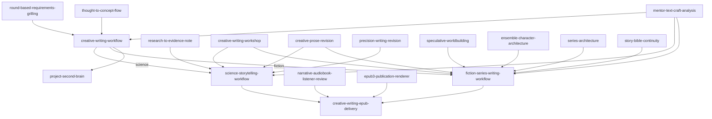

# Creative Writing Architecture

Status: candidate architecture  
Date: 2026-09-06  
Branch: `feat/creative-writing-universe`

## Purpose

Extend Skillz with a governed creative-writing capability for two primary missions:

1. explain science to non-scientists without losing scientific fidelity;
2. develop science-fiction and fantasy projects with persistent worlds, ensemble casts and multi-volume continuity.

The architecture follows recurring teaching patterns from influential creative-writing and science-writing programmes: reading like a writer, research, deliberate craft exercises, drafting, workshop critique, revision and renewed review. It deliberately separates factual truth, fictional canon and project-process memory.

## Architectural invariants

1. **Grilling first.** A substantial writing project begins with `round-based-requirements-grilling`.
2. **No one-shot novel generation as the default.** The default path is craft model -> architecture -> draft -> workshop -> revision -> gate.
3. **Evidence and narrative remain separate in science writing.** `research-to-evidence-note` owns scientific claims; narrative skills may explain but not silently strengthen them.
4. **Canon is not project memory.** `project-second-brain` records how the project evolved; the Story Bible records what is true inside the fictional universe.
5. **Three knowledge layers for fiction.** World truth, character knowledge/belief and reader knowledge are distinct.
6. **Workers own their artifacts.** Orchestrators reference worker outputs instead of duplicating ownership.
7. **EPUB is a delivery projection.** Rendering does not rewrite the manuscript.
8. **ElevenReader is a target platform, not a claimed runtime guarantee.** Structural EPUB3 compatibility is validated automatically; actual import and voice performance remain an integration test on the current ElevenReader app.

## Workflow graph



## Shared craft loop

```text
goal + audience + author mode
        ->
mentor-text craft analysis
        ->
narrative/series architecture
        ->
draft
        ->
cold-read workshop
        ->
developmental revision
        ->
scene revision
        ->
line revision
        ->
domain gate
        ->
publication delivery
```

Author modes:

- `coach`: teach and critique; the human remains primary drafter.
- `coauthor`: jointly develop architecture and prose.
- `writer`: Skillz may draft complete prose under the confirmed contract.
- `editor`: user manuscript remains the source; Skillz diagnoses and revises only as authorized.

## Science path

```text
research question
 -> source retrieval
 -> research-to-evidence-note
 -> science narrative model
 -> explanation model
 -> draft
 -> creative-writing-workshop(mode=lay-reader-science)
 -> creative-prose-revision
 -> precision-writing-revision / fidelity lock
 -> science-story.md
 -> narrative listener gate
 -> EPUB3
```

The explanation model records for every difficult concept:

- required reader understanding;
- audience prior-knowledge assumption;
- analogy or concrete model;
- why the analogy works;
- where the analogy breaks;
- misconception risk;
- evidence references.

A lay-reader pass is judged by the model the reader is likely to reconstruct, not merely by sentence simplicity.

## Fiction path

### Story hierarchy

```text
Universe
  -> Series
     -> Volume
        -> Part / Act
           -> Chapter
              -> Scene
                 -> Beat
```

### Core story entities

- character;
- relationship;
- faction;
- location;
- culture;
- institution;
- technology;
- magic system;
- species;
- object;
- event;
- mystery;
- promise/setup;
- secret;
- rule;
- historical fact.

### Three truth layers

```text
WORLD TRUTH      what is actually true in-universe
CHARACTER STATE  what a character knows, believes, suspects or misunderstands
READER STATE     what has been disclosed, implied or concealed at a given point
```

Continuity checks compare all three against the scene timestamp and publication order.

### Canon lifecycle

```text
idea
 -> planned
 -> draft canon
 -> approved canon
 -> published hard canon
```

Published hard canon is immutable by default. A proposed retcon requires a `canon-impact-analysis.json` identifying affected scenes, characters, knowledge states, setups/payoffs and downstream volumes.

## Story Bible and Project Second Brain

`project-second-brain` answers:

> What did the project decide, change or produce, on what evidence, and what happens next?

The Story Bible answers:

> What is true in the fictional world at this point in canon?

They may link to each other but must not be merged.

## EPUB / ElevenReader delivery spine

```text
final manuscript
 -> narrative-audiobook-listener-review
 -> required revisions
 -> listener gate = pass
 -> epub3-publication-renderer
 -> structural EPUB validation
 -> creative-writing.epub
 -> optional ElevenReader import smoke test
```

EPUB requirements:

- EPUB3 package;
- UTF-8;
- uncompressed first `mimetype` entry;
- OPF manifest/spine;
- EPUB navigation document;
- NCX compatibility navigation;
- chapter-level navigation;
- semantic paragraph preservation;
- scene-break preservation;
- no JavaScript dependency;
- no layout that must be visually inspected to understand the text;
- metadata for title, author and language.

For fiction, TTS adaptation must preserve literary rhythm, dialogue, intentional fragments and narrative voice. It must not apply tutorial-style didactic smoothing.

## Capability set

Initial implementation:

1. `creative-writing-workflow`
2. `mentor-text-craft-analysis`
3. `science-storytelling-workflow`
4. `fiction-series-writing-workflow`
5. `speculative-worldbuilding`
6. `ensemble-character-architecture`
7. `series-architecture`
8. `story-bible-continuity`
9. `creative-writing-workshop`
10. `creative-prose-revision`

EPUB extension:

11. `narrative-audiobook-listener-review`
12. `creative-writing-epub-delivery`
13. `epub3-publication-renderer` (internal infrastructure worker)

## Academic design references

Patterns were derived from publicly available current course/programme information from Iowa Writers' Workshop, Columbia, Stanford/Stegner, Oxford, Cambridge, Harvard, NYU, MIT Graduate Program in Science Writing and Johns Hopkins Science Writing. These are design references, not claims of curricular equivalence or endorsement.

## Completion target

The capability is mature when a project can move from Grilling to a persistent evidence/canon model, generate and revise a complete chaptered manuscript, detect cross-volume continuity errors, preserve science fidelity where applicable, pass a critical listener gate and produce a structurally valid EPUB3 suitable for practical ElevenReader import testing.
