# Skill Dependency Graph

Generated from canonical `requires` and `outputs` frontmatter. Do not edit manually.

```mermaid
graph TD
  agent_handoff --> iterate_software_projects
  architecture_deepening_review --> disciplined_diagnosis
  architecture_deepening_review --> iterate_software_projects
  audit_inspection_finding_response --> decision_record
  audit_inspection_finding_response --> regulatory_evidence_traceability
  central_skill_repository_curation --> composable_skill_factory
  clinical_evidence_update_impact --> decision_record
  clinical_evidence_update_impact --> regulated_product_context
  clinical_evidence_update_impact --> regulatory_evidence_traceability
  clinical_evidence_update_impact --> research_to_evidence_note
  controlled_quality_documentation --> regulated_product_context
  controlled_quality_documentation --> two_axis_compliance_review
  daily_and_weekly_review --> inbox_action_triage
  decision_and_follow_up_tracker --> daily_and_weekly_review
  decision_and_follow_up_tracker --> meeting_preparation
  decision_and_follow_up_tracker --> project_status_brief
  decision_record --> agent_handoff
  decision_record --> large_work_wayfinder
  decision_record --> throwaway_prototype
  decision_record --> two_axis_code_review
  design_change_regulatory_impact --> decision_record
  design_change_regulatory_impact --> design_control_traceability
  design_change_regulatory_impact --> medical_device_risk_management_iso14971
  design_change_regulatory_impact --> regulatory_evidence_traceability
  design_control_traceability --> medical_device_risk_management_iso14971
  design_control_traceability --> regulated_product_context
  design_control_traceability --> two_axis_compliance_review
  disciplined_diagnosis --> iterate_software_projects
  domain_model_maintenance --> agent_handoff
  domain_model_maintenance --> architecture_deepening_review
  domain_model_maintenance --> decision_record
  domain_model_maintenance --> test_driven_vertical_slice
  domain_model_maintenance --> two_axis_code_review
  eu_mdr_ivdr_regulatory_specialist --> medical_device_risk_management_iso14971
  eu_mdr_ivdr_regulatory_specialist --> regulated_product_context
  eu_mdr_ivdr_regulatory_specialist --> research_to_evidence_note
  eudamed_udi_ivd --> ivdr_device_classification
  eudamed_udi_ivd --> medical_device_labeling_ifu
  eudamed_udi_ivd --> regulated_product_context
  eudamed_udi_ivd --> regulatory_evidence_traceability
  evidence_based_causal_investigation --> research_to_evidence_note
  fda_510k_predicate_strategy --> fda_device_classification_product_code
  fda_510k_predicate_strategy --> regulated_product_context
  fda_510k_predicate_strategy --> regulatory_evidence_traceability
  fda_510k_predicate_strategy --> research_to_evidence_note
  fda_510k_substantial_equivalence --> fda_510k_predicate_strategy
  fda_510k_substantial_equivalence --> medical_device_risk_management_iso14971
  fda_510k_substantial_equivalence --> regulatory_evidence_traceability
  fda_acceptance_readiness --> fda_estar_submission_builder
  fda_acceptance_readiness --> regulatory_evidence_traceability
  fda_acceptance_readiness --> two_axis_compliance_review
  fda_additional_information_response --> decision_record
  fda_additional_information_response --> fda_estar_submission_builder
  fda_additional_information_response --> regulatory_evidence_traceability
  fda_complaint_mdr_reportability --> medical_device_risk_management_iso14971
  fda_complaint_mdr_reportability --> quality_record_integrity
  fda_complaint_mdr_reportability --> regulated_product_context
  fda_complaint_mdr_reportability --> regulatory_evidence_traceability
  fda_corrections_removals --> decision_record
  fda_corrections_removals --> fda_complaint_mdr_reportability
  fda_corrections_removals --> medical_device_capa
  fda_corrections_removals --> medical_device_risk_management_iso14971
  fda_de_novo_special_controls --> fda_de_novo_strategy
  fda_de_novo_special_controls --> medical_device_risk_management_iso14971
  fda_de_novo_special_controls --> regulatory_evidence_traceability
  fda_de_novo_strategy --> fda_device_classification_product_code
  fda_de_novo_strategy --> medical_device_risk_management_iso14971
  fda_de_novo_strategy --> regulated_product_context
  fda_de_novo_strategy --> regulatory_evidence_traceability
  fda_device_classification_product_code --> regulated_product_context
  fda_device_classification_product_code --> regulatory_evidence_traceability
  fda_device_classification_product_code --> research_to_evidence_note
  fda_dual_510k_clia_waiver --> fda_510k_substantial_equivalence
  fda_dual_510k_clia_waiver --> fda_ivd_clia_waiver
  fda_dual_510k_clia_waiver --> regulatory_evidence_traceability
  fda_estar_submission_builder --> fda_medical_device_ivd_regulatory_specialist
  fda_estar_submission_builder --> regulatory_evidence_traceability
  fda_ivd_clia_waiver --> fda_device_classification_product_code
  fda_ivd_clia_waiver --> medical_device_risk_management_iso14971
  fda_ivd_clia_waiver --> regulated_product_context
  fda_ivd_clia_waiver --> regulatory_evidence_traceability
  fda_medical_device_ivd_regulatory_specialist --> medical_device_qms_iso13485
  fda_medical_device_ivd_regulatory_specialist --> regulated_product_context
  fda_medical_device_ivd_regulatory_specialist --> research_to_evidence_note
  fda_pccp_change_control --> decision_record
  fda_pccp_change_control --> design_change_regulatory_impact
  fda_pccp_change_control --> medical_device_risk_management_iso14971
  fda_pccp_change_control --> regulatory_evidence_traceability
  fda_qmsr_inspection_readiness --> fda_qmsr_iso13485_gap
  fda_qmsr_inspection_readiness --> iso13485_qms_audit
  fda_qmsr_inspection_readiness --> two_axis_compliance_review
  fda_qmsr_iso13485_gap --> medical_device_qms_iso13485
  fda_qmsr_iso13485_gap --> regulatory_evidence_traceability
  fda_qmsr_iso13485_gap --> two_axis_compliance_review
  fda_qsub_strategy --> decision_record
  fda_qsub_strategy --> fda_medical_device_ivd_regulatory_specialist
  fda_qsub_strategy --> regulatory_evidence_traceability
  fda_registration_listing_udi --> decision_record
  fda_registration_listing_udi --> medical_device_labeling_ifu
  fda_registration_listing_udi --> regulated_product_context
  fda_registration_listing_udi --> regulatory_evidence_traceability
  iec62304_software_lifecycle --> design_control_traceability
  iec62304_software_lifecycle --> medical_device_qms_iso13485
  iec62304_software_lifecycle --> medical_device_risk_management_iso14971
  iec62304_software_lifecycle --> regulated_product_context
  iec62366_usability_engineering --> design_control_traceability
  iec62366_usability_engineering --> medical_device_labeling_ifu
  iec62366_usability_engineering --> medical_device_risk_management_iso14971
  iec62366_usability_engineering --> regulated_product_context
  implement_from_issue --> agent_handoff
  implement_from_issue --> deferred_external_action_verification
  implement_from_issue --> disciplined_diagnosis
  implement_from_issue --> test_driven_vertical_slice
  iso13485_qms_audit --> medical_device_qms_iso13485
  iso13485_qms_audit --> two_axis_compliance_review
  iso27001_isms_audit --> medical_device_isms_governance
  iso27001_isms_audit --> two_axis_compliance_review
  ivdr_analytical_performance --> medical_device_risk_management_iso14971
  ivdr_analytical_performance --> regulated_product_context
  ivdr_analytical_performance --> regulatory_evidence_traceability
  ivdr_class_d_conformity --> ivdr_device_classification
  ivdr_class_d_conformity --> ivdr_performance_evaluation
  ivdr_class_d_conformity --> mdcg_guidance_navigator
  ivdr_class_d_conformity --> regulatory_evidence_traceability
  ivdr_clinical_performance_study --> mdcg_guidance_navigator
  ivdr_clinical_performance_study --> medical_device_risk_management_iso14971
  ivdr_clinical_performance_study --> regulated_product_context
  ivdr_clinical_performance_study --> regulatory_evidence_traceability
  ivdr_companion_diagnostic_consultation --> decision_record
  ivdr_companion_diagnostic_consultation --> ivdr_device_classification
  ivdr_companion_diagnostic_consultation --> ivdr_performance_evaluation
  ivdr_companion_diagnostic_consultation --> regulated_product_context
  ivdr_companion_diagnostic_consultation --> regulatory_evidence_traceability
  ivdr_device_classification --> mdcg_guidance_navigator
  ivdr_device_classification --> regulated_product_context
  ivdr_device_classification --> regulatory_evidence_traceability
  ivdr_inhouse_health_institution --> decision_record
  ivdr_inhouse_health_institution --> medical_device_qms_iso13485
  ivdr_inhouse_health_institution --> medical_device_risk_management_iso14971
  ivdr_inhouse_health_institution --> regulated_product_context
  ivdr_inhouse_health_institution --> regulatory_evidence_traceability
  ivdr_performance_evaluation --> ivdr_analytical_performance
  ivdr_performance_evaluation --> ivdr_clinical_performance_study
  ivdr_performance_evaluation --> ivdr_scientific_validity
  ivdr_performance_evaluation --> regulatory_evidence_traceability
  ivdr_performance_evaluation_report --> ivdr_performance_evaluation
  ivdr_performance_evaluation_report --> mdcg_guidance_navigator
  ivdr_performance_evaluation_report --> regulatory_evidence_traceability
  ivdr_pmpf --> ivdr_performance_evaluation
  ivdr_pmpf --> mdcg_guidance_navigator
  ivdr_pmpf --> medical_device_risk_management_iso14971
  ivdr_pmpf --> regulatory_evidence_traceability
  ivdr_pms_vigilance --> mdcg_guidance_navigator
  ivdr_pms_vigilance --> medical_device_pms_system
  ivdr_pms_vigilance --> medical_device_risk_management_iso14971
  ivdr_pms_vigilance --> regulated_product_context
  ivdr_pms_vigilance --> regulatory_evidence_traceability
  ivdr_pms_vigilance --> two_axis_compliance_review
  ivdr_scientific_validity --> regulated_product_context
  ivdr_scientific_validity --> regulatory_evidence_traceability
  ivdr_scientific_validity --> research_to_evidence_note
  knowledge_map_generator --> structured_knowledge_artifact
  knowledge_view --> structured_knowledge_artifact
  large_work_wayfinder --> agent_handoff
  large_work_wayfinder --> architecture_deepening_review
  large_work_wayfinder --> disciplined_diagnosis
  large_work_wayfinder --> spec_to_vertical_issues
  mdcg_guidance_navigator --> regulated_product_context
  mdcg_guidance_navigator --> regulatory_evidence_traceability
  mdcg_guidance_navigator --> research_to_evidence_note
  mdsap_audit_readiness --> iso13485_qms_audit
  mdsap_audit_readiness --> medical_device_qms_iso13485
  mdsap_audit_readiness --> regulatory_evidence_traceability
  measurement_system_validation --> medical_device_qms_iso13485
  measurement_system_validation --> medical_device_risk_management_iso14971
  measurement_system_validation --> two_axis_compliance_review
  medical_device_capa --> evidence_based_causal_investigation
  medical_device_capa --> medical_device_qms_iso13485
  medical_device_capa --> medical_device_risk_management_iso14971
  medical_device_cybersecurity_lifecycle --> design_control_traceability
  medical_device_cybersecurity_lifecycle --> iec62304_software_lifecycle
  medical_device_cybersecurity_lifecycle --> medical_device_risk_management_iso14971
  medical_device_cybersecurity_lifecycle --> regulated_product_context
  medical_device_isms_governance --> regulated_product_context
  medical_device_isms_governance --> two_axis_compliance_review
  medical_device_labeling_ifu --> medical_device_risk_management_iso14971
  medical_device_labeling_ifu --> regulated_product_context
  medical_device_labeling_ifu --> regulatory_evidence_traceability
  medical_device_pms_system --> decision_record
  medical_device_pms_system --> medical_device_risk_management_iso14971
  medical_device_pms_system --> regulated_product_context
  medical_device_pms_system --> regulatory_evidence_traceability
  medical_device_privacy_gdpr_bdsg --> regulated_product_context
  medical_device_privacy_gdpr_bdsg --> research_to_evidence_note
  medical_device_privacy_gdpr_bdsg --> two_axis_compliance_review
  medical_device_qms_iso13485 --> regulated_product_context
  medical_device_qms_iso13485 --> two_axis_compliance_review
  medical_device_regulatory_strategy --> eu_mdr_ivdr_regulatory_specialist
  medical_device_regulatory_strategy --> fda_medical_device_ivd_regulatory_specialist
  medical_device_regulatory_strategy --> large_work_wayfinder
  medical_device_regulatory_strategy --> medical_device_risk_management_iso14971
  medical_device_regulatory_strategy --> regulated_product_context
  medical_device_risk_management_iso14971 --> regulated_product_context
  medical_device_risk_management_iso14971 --> research_to_evidence_note
  meeting_preparation --> research_to_evidence_note
  memory_sync_reconciliation --> communication_memory_governance
  merge_conflict_resolution --> agent_handoff
  merge_conflict_resolution --> deferred_external_action_verification
  merge_conflict_resolution --> disciplined_diagnosis
  merge_conflict_resolution --> test_driven_vertical_slice
  merge_conflict_resolution --> two_axis_code_review
  nonconformance_mrb_disposition --> medical_device_qms_iso13485
  nonconformance_mrb_disposition --> medical_device_risk_management_iso14971
  nonconformance_mrb_disposition --> two_axis_compliance_review
  obsidian_adapter --> knowledge_map_generator
  obsidian_adapter --> knowledge_view
  obsidian_adapter --> structured_knowledge_artifact
  process_validation_iq_oq_pq --> design_control_traceability
  process_validation_iq_oq_pq --> medical_device_qms_iso13485
  process_validation_iq_oq_pq --> medical_device_risk_management_iso14971
  project_beta_readiness --> iterate_software_projects
  qms_management_review_action_followup --> decision_and_follow_up_tracker
  qms_management_review_action_followup --> deferred_external_action_verification
  qms_management_review_action_followup --> qms_management_review_governance
  qms_management_review_governance --> iso13485_qms_audit
  qms_management_review_governance --> medical_device_capa
  qms_management_review_governance --> medical_device_pms_system
  qms_management_review_governance --> medical_device_qms_iso13485
  qms_management_review_governance --> project_status_brief
  quality_record_integrity --> controlled_quality_documentation
  quality_record_integrity --> medical_device_qms_iso13485
  quality_record_integrity --> two_axis_compliance_review
  regulatory_change_impact_orchestrator --> decision_record
  regulatory_change_impact_orchestrator --> regulated_product_context
  regulatory_change_impact_orchestrator --> regulatory_evidence_traceability
  regulatory_change_monitoring --> regulatory_evidence_traceability
  regulatory_change_monitoring --> research_to_evidence_note
  regulatory_claims_consistency --> design_control_traceability
  regulatory_claims_consistency --> medical_device_labeling_ifu
  regulatory_claims_consistency --> regulated_product_context
  regulatory_claims_consistency --> regulatory_evidence_traceability
  regulatory_evidence_traceability --> regulated_product_context
  regulatory_evidence_traceability --> research_to_evidence_note
  spec_to_vertical_issues --> conversation_to_spec
  supplier_quality_medical_device --> medical_device_qms_iso13485
  supplier_quality_medical_device --> medical_device_risk_management_iso14971
  supplier_quality_medical_device --> two_axis_compliance_review
  test_driven_vertical_slice --> disciplined_diagnosis
  test_driven_vertical_slice --> spec_to_vertical_issues
  throwaway_prototype --> agent_handoff
  throwaway_prototype --> disciplined_diagnosis
  throwaway_prototype --> large_work_wayfinder
  throwaway_prototype --> spec_to_vertical_issues
  two_axis_code_review --> agent_handoff
  two_axis_code_review --> architecture_deepening_review
  two_axis_code_review --> disciplined_diagnosis
  two_axis_code_review --> implement_from_issue
  two_axis_compliance_review --> research_to_evidence_note
```

## Output contracts

`consumerSkills` are inferred only from hard `requires` edges to a unique producer; ambiguous producers never receive inferred consumers. A missing inferred consumer is reported as `unconsumed`, not as an orphan verdict: terminal user-facing artifacts are valid outputs.

| Output | Producers | Consumer skills | Status |
|---|---|---|---|
| `GRILL-REPORT.md` | `round-based-requirements-grilling` | — | unconsumed |
| `SPEC.md` | `conversation-to-spec` | `spec-to-vertical-issues` | inferred |
| `acceptance-gaps.json` | `fda-acceptance-readiness` | — | unconsumed |
| `agent-handoff.json` | `agent-handoff` | `decision-record`, `domain-model-maintenance`, `implement-from-issue`, `large-work-wayfinder`, `merge-conflict-resolution`, `throwaway-prototype`, `two-axis-code-review` | inferred |
| `agent-handoff.md` | `agent-handoff` | `decision-record`, `domain-model-maintenance`, `implement-from-issue`, `large-work-wayfinder`, `merge-conflict-resolution`, `throwaway-prototype`, `two-axis-code-review` | inferred |
| `analytical-performance-assessment.json` | `ivdr-analytical-performance` | `ivdr-performance-evaluation` | inferred |
| `analytical-performance-plan.json` | `ivdr-analytical-performance` | `ivdr-performance-evaluation` | inferred |
| `analytical-performance-report.md` | `ivdr-analytical-performance` | `ivdr-performance-evaluation` | inferred |
| `approved SPEC.md` | `round-based-requirements-grilling` | — | unconsumed |
| `architecture-review.json` | `architecture-deepening-review` | `domain-model-maintenance`, `large-work-wayfinder`, `two-axis-code-review` | inferred |
| `architecture-review.md` | `architecture-deepening-review` | `domain-model-maintenance`, `large-work-wayfinder`, `two-axis-code-review` | inferred |
| `audit-finding-response-map.json` | `audit-inspection-finding-response` | — | unconsumed |
| `beta-readiness.json` | `project-beta-readiness` | — | unconsumed |
| `beta-readiness.md` | `project-beta-readiness` | — | unconsumed |
| `beta-runbook.md` | `project-beta-readiness` | — | unconsumed |
| `capa-effectiveness-plan.json` | `medical-device-capa` | `fda-corrections-removals`, `qms-management-review-governance` | inferred |
| `capa-plan.json` | `medical-device-capa` | `fda-corrections-removals`, `qms-management-review-governance` | inferred |
| `capa-status.md` | `medical-device-capa` | `fda-corrections-removals`, `qms-management-review-governance` | inferred |
| `causal-investigation.json` | `evidence-based-causal-investigation` | `medical-device-capa` | inferred |
| `causal-investigation.md` | `evidence-based-causal-investigation` | `medical-device-capa` | inferred |
| `cdx-consultation-readiness.json` | `ivdr-companion-diagnostic-consultation` | — | unconsumed |
| `cdx-medicinal-product-linkage.json` | `ivdr-companion-diagnostic-consultation` | — | unconsumed |
| `cdx-scope-assessment.json` | `ivdr-companion-diagnostic-consultation` | — | unconsumed |
| `change-impact-assessment.json` | `controlled-quality-documentation` | `quality-record-integrity` | inferred |
| `change-integration-status.json` | `regulatory-change-impact-orchestrator` | — | unconsumed |
| `change-verification-needs.json` | `design-change-regulatory-impact` | `fda-pccp-change-control` | inferred |
| `claim-conflicts.json` | `regulatory-claims-consistency` | — | unconsumed |
| `claims-consistency-map.json` | `regulatory-claims-consistency` | — | unconsumed |
| `claims-remediation-plan.md` | `regulatory-claims-consistency` | — | unconsumed |
| `class-d-conformity-plan.json` | `ivdr-class-d-conformity` | — | unconsumed |
| `class-d-external-dependencies.json` | `ivdr-class-d-conformity` | — | unconsumed |
| `clia-evidence-gaps.json` | `fda-ivd-clia-waiver` | `fda-dual-510k-clia-waiver` | inferred |
| `clia-waiver-strategy.json` | `fda-ivd-clia-waiver` | `fda-dual-510k-clia-waiver` | inferred |
| `clinical-evidence-actions.json` | `clinical-evidence-update-impact` | — | unconsumed |
| `clinical-evidence-delta.json` | `clinical-evidence-update-impact` | — | unconsumed |
| `clinical-evidence-impact-map.json` | `clinical-evidence-update-impact` | — | unconsumed |
| `clinical-performance-evidence.json` | `ivdr-clinical-performance-study` | `ivdr-performance-evaluation` | inferred |
| `clinical-performance-study-plan.json` | `ivdr-clinical-performance-study` | `ivdr-performance-evaluation` | inferred |
| `communication-profile.json` | `communication-memory-governance` | `memory-sync-reconciliation` | inferred |
| `communication-profile.merged.json` | `memory-sync-reconciliation` | — | unconsumed |
| `complaint-regulatory-actions.json` | `fda-complaint-mdr-reportability` | `fda-corrections-removals` | inferred |
| `compliance-evidence-effectiveness.json` | `two-axis-compliance-review` | `controlled-quality-documentation`, `design-control-traceability`, `fda-acceptance-readiness`, `fda-qmsr-inspection-readiness`, `fda-qmsr-iso13485-gap`, `iso13485-qms-audit`, `iso27001-isms-audit`, `ivdr-pms-vigilance`, `measurement-system-validation`, `medical-device-isms-governance`, `medical-device-privacy-gdpr-bdsg`, `medical-device-qms-iso13485`, `nonconformance-mrb-disposition`, `quality-record-integrity`, `supplier-quality-medical-device` | inferred |
| `compliance-requirement-coverage.json` | `two-axis-compliance-review` | `controlled-quality-documentation`, `design-control-traceability`, `fda-acceptance-readiness`, `fda-qmsr-inspection-readiness`, `fda-qmsr-iso13485-gap`, `iso13485-qms-audit`, `iso27001-isms-audit`, `ivdr-pms-vigilance`, `measurement-system-validation`, `medical-device-isms-governance`, `medical-device-privacy-gdpr-bdsg`, `medical-device-qms-iso13485`, `nonconformance-mrb-disposition`, `quality-record-integrity`, `supplier-quality-medical-device` | inferred |
| `compliance-review-decision.md` | `two-axis-compliance-review` | `controlled-quality-documentation`, `design-control-traceability`, `fda-acceptance-readiness`, `fda-qmsr-inspection-readiness`, `fda-qmsr-iso13485-gap`, `iso13485-qms-audit`, `iso27001-isms-audit`, `ivdr-pms-vigilance`, `measurement-system-validation`, `medical-device-isms-governance`, `medical-device-privacy-gdpr-bdsg`, `medical-device-qms-iso13485`, `nonconformance-mrb-disposition`, `quality-record-integrity`, `supplier-quality-medical-device` | inferred |
| `conflict-residual-risk-handoff.json` | `merge-conflict-resolution` | — | unconsumed |
| `conflict-resolution-evidence.json` | `merge-conflict-resolution` | — | unconsumed |
| `consistency report` | `conversation-to-spec` | `spec-to-vertical-issues` | inferred |
| `containment-actions.json` | `nonconformance-mrb-disposition` | — | unconsumed |
| `continuation result` | `deferred-external-action-verification` | `implement-from-issue`, `merge-conflict-resolution`, `qms-management-review-action-followup` | inferred |
| `controlled-document-plan.md` | `controlled-quality-documentation` | `quality-record-integrity` | inferred |
| `correction-removal-action-plan.json` | `fda-corrections-removals` | — | unconsumed |
| `correction-removal-assessment.json` | `fda-corrections-removals` | — | unconsumed |
| `correction-removal-reporting-state.json` | `fda-corrections-removals` | — | unconsumed |
| `cybersecurity-evidence-map.json` | `medical-device-cybersecurity-lifecycle` | — | unconsumed |
| `cybersecurity-lifecycle-assessment.json` | `medical-device-cybersecurity-lifecycle` | — | unconsumed |
| `cybersecurity-postmarket-actions.json` | `medical-device-cybersecurity-lifecycle` | — | unconsumed |
| `de-novo-evidence-gaps.json` | `fda-de-novo-strategy` | `fda-de-novo-special-controls` | inferred |
| `de-novo-risk-control-rationale.md` | `fda-de-novo-special-controls` | — | unconsumed |
| `de-novo-strategy.json` | `fda-de-novo-strategy` | `fda-de-novo-special-controls` | inferred |
| `decision register` | `conversation-to-spec` | `spec-to-vertical-issues` | inferred |
| `decision-follow-up-register.json` | `decision-and-follow-up-tracker` | `qms-management-review-action-followup` | inferred |
| `decision-follow-up-register.md` | `decision-and-follow-up-tracker` | `qms-management-review-action-followup` | inferred |
| `decision-record.json` | `decision-record` | `audit-inspection-finding-response`, `clinical-evidence-update-impact`, `design-change-regulatory-impact`, `domain-model-maintenance`, `fda-additional-information-response`, `fda-corrections-removals`, `fda-pccp-change-control`, `fda-qsub-strategy`, `fda-registration-listing-udi`, `ivdr-companion-diagnostic-consultation`, `ivdr-inhouse-health-institution`, `medical-device-pms-system`, `regulatory-change-impact-orchestrator` | inferred |
| `decision-record.md` | `decision-record` | `audit-inspection-finding-response`, `clinical-evidence-update-impact`, `design-change-regulatory-impact`, `domain-model-maintenance`, `fda-additional-information-response`, `fda-corrections-removals`, `fda-pccp-change-control`, `fda-qsub-strategy`, `fda-registration-listing-udi`, `ivdr-companion-diagnostic-consultation`, `ivdr-inhouse-health-institution`, `medical-device-pms-system`, `regulatory-change-impact-orchestrator` | inferred |
| `dependency-graph.json` | `large-work-wayfinder` | `decision-record`, `medical-device-regulatory-strategy`, `throwaway-prototype` | inferred |
| `dependency-order.json` | `spec-to-vertical-issues` | `large-work-wayfinder`, `test-driven-vertical-slice`, `throwaway-prototype` | inferred |
| `design-change-impact.json` | `design-change-regulatory-impact` | `fda-pccp-change-control` | inferred |
| `design-control-traceability.json` | `design-control-traceability` | `design-change-regulatory-impact`, `iec62304-software-lifecycle`, `iec62366-usability-engineering`, `medical-device-cybersecurity-lifecycle`, `process-validation-iq-oq-pq`, `regulatory-claims-consistency` | inferred |
| `design-evidence-gaps.json` | `design-control-traceability` | `design-change-regulatory-impact`, `iec62304-software-lifecycle`, `iec62366-usability-engineering`, `medical-device-cybersecurity-lifecycle`, `process-validation-iq-oq-pq`, `regulatory-claims-consistency` | inferred |
| `diagnosis-report.json` | `disciplined-diagnosis` | `architecture-deepening-review`, `implement-from-issue`, `large-work-wayfinder`, `merge-conflict-resolution`, `test-driven-vertical-slice`, `throwaway-prototype`, `two-axis-code-review` | inferred |
| `diagnosis-residual-risk-handoff.json` | `disciplined-diagnosis` | `architecture-deepening-review`, `implement-from-issue`, `large-work-wayfinder`, `merge-conflict-resolution`, `test-driven-vertical-slice`, `throwaway-prototype`, `two-axis-code-review` | inferred |
| `disposal-record.json` | `throwaway-prototype` | `decision-record` | inferred |
| `docs/agents/CONFIG.md` | `repository-skill-bootstrap` | — | unconsumed |
| `docs/agents/CONTEXT.md` | `repository-skill-bootstrap` | — | unconsumed |
| `docs/agents/DECISIONS.md` | `repository-skill-bootstrap` | — | unconsumed |
| `document-control-assessment.json` | `controlled-quality-documentation` | `quality-record-integrity` | inferred |
| `domain-change-plan.md` | `domain-model-maintenance` | — | unconsumed |
| `domain-model-map.json` | `domain-model-maintenance` | — | unconsumed |
| `domain-validation.json` | `domain-model-maintenance` | — | unconsumed |
| `dpia-decision.json` | `medical-device-privacy-gdpr-bdsg` | — | unconsumed |
| `dual-510k-clia-strategy.json` | `fda-dual-510k-clia-waiver` | — | unconsumed |
| `dual-evidence-package.json` | `fda-dual-510k-clia-waiver` | — | unconsumed |
| `dual-study-evidence-map.json` | `fda-dual-510k-clia-waiver` | — | unconsumed |
| `estar-content-map.json` | `fda-estar-submission-builder` | `fda-acceptance-readiness`, `fda-additional-information-response` | inferred |
| `eu-regulatory-assessment.json` | `eu-mdr-ivdr-regulatory-specialist` | `medical-device-regulatory-strategy` | inferred |
| `eu-regulatory-assessment.md` | `eu-mdr-ivdr-regulatory-specialist` | `medical-device-regulatory-strategy` | inferred |
| `eu-regulatory-investigations.json` | `eu-mdr-ivdr-regulatory-specialist` | `medical-device-regulatory-strategy` | inferred |
| `eudamed-readiness.json` | `eudamed-udi-ivd` | — | unconsumed |
| `evaluation evidence` | `composable-skill-factory` | `central-skill-repository-curation` | inferred |
| `evidence-note.json` | `research-to-evidence-note` | `clinical-evidence-update-impact`, `eu-mdr-ivdr-regulatory-specialist`, `evidence-based-causal-investigation`, `fda-510k-predicate-strategy`, `fda-device-classification-product-code`, `fda-medical-device-ivd-regulatory-specialist`, `ivdr-scientific-validity`, `mdcg-guidance-navigator`, `medical-device-privacy-gdpr-bdsg`, `medical-device-risk-management-iso14971`, `meeting-preparation`, `regulatory-change-monitoring`, `regulatory-evidence-traceability`, `two-axis-compliance-review` | inferred |
| `evidence-note.md` | `research-to-evidence-note` | `clinical-evidence-update-impact`, `eu-mdr-ivdr-regulatory-specialist`, `evidence-based-causal-investigation`, `fda-510k-predicate-strategy`, `fda-device-classification-product-code`, `fda-medical-device-ivd-regulatory-specialist`, `ivdr-scientific-validity`, `mdcg-guidance-navigator`, `medical-device-privacy-gdpr-bdsg`, `medical-device-risk-management-iso14971`, `meeting-preparation`, `regulatory-change-monitoring`, `regulatory-evidence-traceability`, `two-axis-compliance-review` | inferred |
| `execution plan` | `synapse-orchestrator` | — | unconsumed |
| `expert handoff` | `synapse-orchestrator` | — | unconsumed |
| `fda-acceptance-preflight.json` | `fda-acceptance-readiness` | — | unconsumed |
| `fda-device-classification.json` | `fda-device-classification-product-code` | `fda-510k-predicate-strategy`, `fda-de-novo-strategy`, `fda-ivd-clia-waiver` | inferred |
| `fda-device-listing-readiness.json` | `fda-registration-listing-udi` | — | unconsumed |
| `fda-product-code-evidence.json` | `fda-device-classification-product-code` | `fda-510k-predicate-strategy`, `fda-de-novo-strategy`, `fda-ivd-clia-waiver` | inferred |
| `fda-registration-readiness.json` | `fda-registration-listing-udi` | — | unconsumed |
| `fda-regulatory-assessment.json` | `fda-medical-device-ivd-regulatory-specialist` | `fda-estar-submission-builder`, `fda-qsub-strategy`, `medical-device-regulatory-strategy` | inferred |
| `fda-regulatory-assessment.md` | `fda-medical-device-ivd-regulatory-specialist` | `fda-estar-submission-builder`, `fda-qsub-strategy`, `medical-device-regulatory-strategy` | inferred |
| `fda-regulatory-investigations.json` | `fda-medical-device-ivd-regulatory-specialist` | `fda-estar-submission-builder`, `fda-qsub-strategy`, `medical-device-regulatory-strategy` | inferred |
| `fda-request-issue-map.json` | `fda-additional-information-response` | — | unconsumed |
| `fda-response-package.md` | `fda-additional-information-response` | — | unconsumed |
| `finding-action-plan.json` | `audit-inspection-finding-response` | — | unconsumed |
| `finding-closure-status.json` | `audit-inspection-finding-response` | — | unconsumed |
| `flex-study-needs.json` | `fda-ivd-clia-waiver` | `fda-dual-510k-clia-waiver` | inferred |
| `gudid-udi-readiness.json` | `fda-registration-listing-udi` | — | unconsumed |
| `human-procedure-plan.md` | `human-procedure-wizard` | — | unconsumed |
| `human-procedure-result.json` | `human-procedure-wizard` | — | unconsumed |
| `ifu-content-structure.md` | `medical-device-labeling-ifu` | `eudamed-udi-ivd`, `fda-registration-listing-udi`, `iec62366-usability-engineering`, `regulatory-claims-consistency` | inferred |
| `implementation-evidence.json` | `implement-from-issue` | `two-axis-code-review` | inferred |
| `implementation-residual-risk-handoff.json` | `implement-from-issue` | `two-axis-code-review` | inferred |
| `import verification` | `openasr-offline-model-import` | — | unconsumed |
| `inbox-triage.json` | `inbox-action-triage` | `daily-and-weekly-review` | inferred |
| `inbox-triage.md` | `inbox-action-triage` | `daily-and-weekly-review` | inferred |
| `inhouse-ivd-condition-map.json` | `ivdr-inhouse-health-institution` | — | unconsumed |
| `inhouse-ivd-eligibility.json` | `ivdr-inhouse-health-institution` | — | unconsumed |
| `inhouse-ivd-transition-readiness.json` | `ivdr-inhouse-health-institution` | — | unconsumed |
| `inspection-evidence-index.json` | `fda-qmsr-inspection-readiness` | — | unconsumed |
| `installed OpenASR model` | `openasr-offline-model-import` | — | unconsumed |
| `investigation-backlog.json` | `large-work-wayfinder` | `decision-record`, `medical-device-regulatory-strategy`, `throwaway-prototype` | inferred |
| `isms-audit-findings.json` | `iso27001-isms-audit` | — | unconsumed |
| `isms-audit-plan.json` | `iso27001-isms-audit` | — | unconsumed |
| `isms-audit-report.md` | `iso27001-isms-audit` | — | unconsumed |
| `isms-governance-assessment.json` | `medical-device-isms-governance` | `iso27001-isms-audit` | inferred |
| `isms-governance.md` | `medical-device-isms-governance` | `iso27001-isms-audit` | inferred |
| `isms-risk-treatment-context.json` | `medical-device-isms-governance` | `iso27001-isms-audit` | inferred |
| `ivd-udi-data-set.json` | `eudamed-udi-ivd` | — | unconsumed |
| `ivdr-classification-assessment.json` | `ivdr-device-classification` | `eudamed-udi-ivd`, `ivdr-class-d-conformity`, `ivdr-companion-diagnostic-consultation` | inferred |
| `ivdr-classification-rationale.md` | `ivdr-device-classification` | `eudamed-udi-ivd`, `ivdr-class-d-conformity`, `ivdr-companion-diagnostic-consultation` | inferred |
| `ivdr-performance-evaluation-gaps.json` | `ivdr-performance-evaluation` | `ivdr-class-d-conformity`, `ivdr-companion-diagnostic-consultation`, `ivdr-performance-evaluation-report`, `ivdr-pmpf` | inferred |
| `ivdr-performance-evaluation.json` | `ivdr-performance-evaluation` | `ivdr-class-d-conformity`, `ivdr-companion-diagnostic-consultation`, `ivdr-performance-evaluation-report`, `ivdr-pmpf` | inferred |
| `ivdr-pms-assessment.json` | `ivdr-pms-vigilance` | — | unconsumed |
| `knowledge-artifact.json` | `structured-knowledge-artifact` | `knowledge-map-generator`, `knowledge-view`, `obsidian-adapter` | inferred |
| `knowledge-artifact.md` | `structured-knowledge-artifact` | `knowledge-map-generator`, `knowledge-view`, `obsidian-adapter` | inferred |
| `knowledge-map.json` | `knowledge-map-generator` | `obsidian-adapter` | inferred |
| `knowledge-view.json` | `knowledge-view` | `obsidian-adapter` | inferred |
| `labeling-content-map.json` | `medical-device-labeling-ifu` | `eudamed-udi-ivd`, `fda-registration-listing-udi`, `iec62366-usability-engineering`, `regulatory-claims-consistency` | inferred |
| `labeling-evidence-gaps.json` | `medical-device-labeling-ifu` | `eudamed-udi-ivd`, `fda-registration-listing-udi`, `iec62366-usability-engineering`, `regulatory-claims-consistency` | inferred |
| `lifecycle-impact-gates.json` | `regulatory-change-impact-orchestrator` | — | unconsumed |
| `management-review-actions.json` | `qms-management-review-governance` | `qms-management-review-action-followup` | inferred |
| `management-review-brief.json` | `qms-management-review-governance` | `qms-management-review-action-followup` | inferred |
| `management-review-brief.md` | `qms-management-review-governance` | `qms-management-review-action-followup` | inferred |
| `management-review-effectiveness-gaps.json` | `qms-management-review-action-followup` | — | unconsumed |
| `management-review-follow-up-status.json` | `qms-management-review-action-followup` | — | unconsumed |
| `management-review-return-input.json` | `qms-management-review-action-followup` | — | unconsumed |
| `mdcg-guidance-changes.json` | `mdcg-guidance-navigator` | `ivdr-class-d-conformity`, `ivdr-clinical-performance-study`, `ivdr-device-classification`, `ivdr-performance-evaluation-report`, `ivdr-pmpf`, `ivdr-pms-vigilance` | inferred |
| `mdcg-guidance-set.json` | `mdcg-guidance-navigator` | `ivdr-class-d-conformity`, `ivdr-clinical-performance-study`, `ivdr-device-classification`, `ivdr-performance-evaluation-report`, `ivdr-pmpf`, `ivdr-pms-vigilance` | inferred |
| `mdr-reportability-assessment.json` | `fda-complaint-mdr-reportability` | `fda-corrections-removals` | inferred |
| `mdsap-audit-scope.json` | `mdsap-audit-readiness` | — | unconsumed |
| `mdsap-evidence-gaps.json` | `mdsap-audit-readiness` | — | unconsumed |
| `mdsap-task-readiness.json` | `mdsap-audit-readiness` | — | unconsumed |
| `measurement-capability-study.json` | `measurement-system-validation` | — | unconsumed |
| `measurement-evidence-gaps.json` | `measurement-system-validation` | — | unconsumed |
| `measurement-system-assessment.json` | `measurement-system-validation` | — | unconsumed |
| `meeting-prep.json` | `meeting-preparation` | `decision-and-follow-up-tracker` | inferred |
| `meeting-prep.md` | `meeting-preparation` | `decision-and-follow-up-tracker` | inferred |
| `memory-ledger.json` | `communication-memory-governance` | `memory-sync-reconciliation` | inferred |
| `memory-ledger.merged.json` | `memory-sync-reconciliation` | — | unconsumed |
| `memory-reconciliation-plan.json` | `memory-sync-reconciliation` | — | unconsumed |
| `mrb-disposition-decision.json` | `nonconformance-mrb-disposition` | — | unconsumed |
| `next increment` | `iterate-software-projects` | `agent-handoff`, `architecture-deepening-review`, `disciplined-diagnosis`, `project-beta-readiness` | inferred |
| `next-step-handoff.json` | `architecture-deepening-review` | `domain-model-maintenance`, `large-work-wayfinder`, `two-axis-code-review` | inferred |
| `nonconformance-assessment.json` | `nonconformance-mrb-disposition` | — | unconsumed |
| `obsidian-candidate.json` | `obsidian-adapter` | — | unconsumed |
| `obsidian-map.canvas` | `obsidian-adapter` | — | unconsumed |
| `obsidian-note.md` | `obsidian-adapter` | — | unconsumed |
| `obsidian-view.base` | `obsidian-adapter` | — | unconsumed |
| `opaque-analysis-evidence.md` | `opaque-system-analysis` | — | unconsumed |
| `pccp-applicability.json` | `fda-pccp-change-control` | — | unconsumed |
| `pccp-change-evidence.json` | `fda-pccp-change-control` | — | unconsumed |
| `pccp-deviation-routing.json` | `fda-pccp-change-control` | — | unconsumed |
| `per-traceability.json` | `ivdr-performance-evaluation-report` | — | unconsumed |
| `performance-evaluation-report.md` | `ivdr-performance-evaluation-report` | — | unconsumed |
| `performance-study-gaps.json` | `ivdr-clinical-performance-study` | `ivdr-performance-evaluation` | inferred |
| `pmpf-evaluation-report.md` | `ivdr-pmpf` | — | unconsumed |
| `pmpf-plan.json` | `ivdr-pmpf` | — | unconsumed |
| `pmpf-signals.json` | `ivdr-pmpf` | — | unconsumed |
| `pms-management-review-input.json` | `medical-device-pms-system` | `ivdr-pms-vigilance`, `qms-management-review-governance` | inferred |
| `pms-review-status.json` | `medical-device-pms-system` | `ivdr-pms-vigilance`, `qms-management-review-governance` | inferred |
| `pms-source-register.json` | `medical-device-pms-system` | `ivdr-pms-vigilance`, `qms-management-review-governance` | inferred |
| `pms-system-plan.json` | `medical-device-pms-system` | `ivdr-pms-vigilance`, `qms-management-review-governance` | inferred |
| `predicate-candidate-set.json` | `fda-510k-predicate-strategy` | `fda-510k-substantial-equivalence` | inferred |
| `predicate-strategy.md` | `fda-510k-predicate-strategy` | `fda-510k-substantial-equivalence` | inferred |
| `privacy-assessment.json` | `medical-device-privacy-gdpr-bdsg` | — | unconsumed |
| `privacy-governance.md` | `medical-device-privacy-gdpr-bdsg` | — | unconsumed |
| `process-validation-assessment.json` | `process-validation-iq-oq-pq` | — | unconsumed |
| `process-validation-protocol.md` | `process-validation-iq-oq-pq` | — | unconsumed |
| `process-validation-strategy.json` | `process-validation-iq-oq-pq` | — | unconsumed |
| `progress summary` | `synapse-orchestrator` | — | unconsumed |
| `project-status.json` | `project-status-brief` | `decision-and-follow-up-tracker`, `qms-management-review-governance` | inferred |
| `project-status.md` | `project-status-brief` | `decision-and-follow-up-tracker`, `qms-management-review-governance` | inferred |
| `prototype-brief.md` | `throwaway-prototype` | `decision-record` | inferred |
| `prototype-evidence.json` | `throwaway-prototype` | `decision-record` | inferred |
| `pull request` | `composable-skill-factory` | `central-skill-repository-curation` | inferred |
| `qms-audit-findings.json` | `iso13485-qms-audit` | `fda-qmsr-inspection-readiness`, `mdsap-audit-readiness`, `qms-management-review-governance` | inferred |
| `qms-audit-plan.json` | `iso13485-qms-audit` | `fda-qmsr-inspection-readiness`, `mdsap-audit-readiness`, `qms-management-review-governance` | inferred |
| `qms-audit-report.md` | `iso13485-qms-audit` | `fda-qmsr-inspection-readiness`, `mdsap-audit-readiness`, `qms-management-review-governance` | inferred |
| `qms-gap-analysis.json` | `medical-device-qms-iso13485` | `fda-medical-device-ivd-regulatory-specialist`, `fda-qmsr-iso13485-gap`, `iec62304-software-lifecycle`, `iso13485-qms-audit`, `ivdr-inhouse-health-institution`, `mdsap-audit-readiness`, `measurement-system-validation`, `medical-device-capa`, `nonconformance-mrb-disposition`, `process-validation-iq-oq-pq`, `qms-management-review-governance`, `quality-record-integrity`, `supplier-quality-medical-device` | inferred |
| `qms-process-map.json` | `medical-device-qms-iso13485` | `fda-medical-device-ivd-regulatory-specialist`, `fda-qmsr-iso13485-gap`, `iec62304-software-lifecycle`, `iso13485-qms-audit`, `ivdr-inhouse-health-institution`, `mdsap-audit-readiness`, `measurement-system-validation`, `medical-device-capa`, `nonconformance-mrb-disposition`, `process-validation-iq-oq-pq`, `qms-management-review-governance`, `quality-record-integrity`, `supplier-quality-medical-device` | inferred |
| `qms-readiness.md` | `medical-device-qms-iso13485` | `fda-medical-device-ivd-regulatory-specialist`, `fda-qmsr-iso13485-gap`, `iec62304-software-lifecycle`, `iso13485-qms-audit`, `ivdr-inhouse-health-institution`, `mdsap-audit-readiness`, `measurement-system-validation`, `medical-device-capa`, `nonconformance-mrb-disposition`, `process-validation-iq-oq-pq`, `qms-management-review-governance`, `quality-record-integrity`, `supplier-quality-medical-device` | inferred |
| `qmsr-gap-assessment.md` | `fda-qmsr-iso13485-gap` | `fda-qmsr-inspection-readiness` | inferred |
| `qmsr-inspection-readiness.json` | `fda-qmsr-inspection-readiness` | — | unconsumed |
| `qmsr-iso13485-delta.json` | `fda-qmsr-iso13485-gap` | `fda-qmsr-inspection-readiness` | inferred |
| `qsub-briefing-package.md` | `fda-qsub-strategy` | — | unconsumed |
| `qsub-commitments.json` | `fda-qsub-strategy` | — | unconsumed |
| `qsub-question-set.json` | `fda-qsub-strategy` | — | unconsumed |
| `quality-record-integrity-assessment.json` | `quality-record-integrity` | `fda-complaint-mdr-reportability` | inferred |
| `quality-review.json` | `two-axis-code-review` | `decision-record`, `domain-model-maintenance`, `merge-conflict-resolution` | inferred |
| `record-integrity-gaps.json` | `quality-record-integrity` | `fda-complaint-mdr-reportability` | inferred |
| `record-retrieval-index.json` | `quality-record-integrity` | `fda-complaint-mdr-reportability` | inferred |
| `recovered-system-model.json` | `opaque-system-analysis` | — | unconsumed |
| `regulated-product-context.json` | `regulated-product-context` | `clinical-evidence-update-impact`, `controlled-quality-documentation`, `design-control-traceability`, `eu-mdr-ivdr-regulatory-specialist`, `eudamed-udi-ivd`, `fda-510k-predicate-strategy`, `fda-complaint-mdr-reportability`, `fda-de-novo-strategy`, `fda-device-classification-product-code`, `fda-ivd-clia-waiver`, `fda-medical-device-ivd-regulatory-specialist`, `fda-registration-listing-udi`, `iec62304-software-lifecycle`, `iec62366-usability-engineering`, `ivdr-analytical-performance`, `ivdr-clinical-performance-study`, `ivdr-companion-diagnostic-consultation`, `ivdr-device-classification`, `ivdr-inhouse-health-institution`, `ivdr-pms-vigilance`, `ivdr-scientific-validity`, `mdcg-guidance-navigator`, `medical-device-cybersecurity-lifecycle`, `medical-device-isms-governance`, `medical-device-labeling-ifu`, `medical-device-pms-system`, `medical-device-privacy-gdpr-bdsg`, `medical-device-qms-iso13485`, `medical-device-regulatory-strategy`, `medical-device-risk-management-iso14971`, `regulatory-change-impact-orchestrator`, `regulatory-claims-consistency`, `regulatory-evidence-traceability` | inferred |
| `regulated-product-context.md` | `regulated-product-context` | `clinical-evidence-update-impact`, `controlled-quality-documentation`, `design-control-traceability`, `eu-mdr-ivdr-regulatory-specialist`, `eudamed-udi-ivd`, `fda-510k-predicate-strategy`, `fda-complaint-mdr-reportability`, `fda-de-novo-strategy`, `fda-device-classification-product-code`, `fda-ivd-clia-waiver`, `fda-medical-device-ivd-regulatory-specialist`, `fda-registration-listing-udi`, `iec62304-software-lifecycle`, `iec62366-usability-engineering`, `ivdr-analytical-performance`, `ivdr-clinical-performance-study`, `ivdr-companion-diagnostic-consultation`, `ivdr-device-classification`, `ivdr-inhouse-health-institution`, `ivdr-pms-vigilance`, `ivdr-scientific-validity`, `mdcg-guidance-navigator`, `medical-device-cybersecurity-lifecycle`, `medical-device-isms-governance`, `medical-device-labeling-ifu`, `medical-device-pms-system`, `medical-device-privacy-gdpr-bdsg`, `medical-device-qms-iso13485`, `medical-device-regulatory-strategy`, `medical-device-risk-management-iso14971`, `regulatory-change-impact-orchestrator`, `regulatory-claims-consistency`, `regulatory-evidence-traceability` | inferred |
| `regulatory-change-decisions.json` | `design-change-regulatory-impact` | `fda-pccp-change-control` | inferred |
| `regulatory-change-events.json` | `regulatory-change-monitoring` | — | unconsumed |
| `regulatory-change-route-map.json` | `regulatory-change-impact-orchestrator` | — | unconsumed |
| `regulatory-change-watch-status.json` | `regulatory-change-monitoring` | — | unconsumed |
| `regulatory-evidence-gaps.json` | `regulatory-evidence-traceability` | `audit-inspection-finding-response`, `clinical-evidence-update-impact`, `design-change-regulatory-impact`, `eudamed-udi-ivd`, `fda-510k-predicate-strategy`, `fda-510k-substantial-equivalence`, `fda-acceptance-readiness`, `fda-additional-information-response`, `fda-complaint-mdr-reportability`, `fda-de-novo-special-controls`, `fda-de-novo-strategy`, `fda-device-classification-product-code`, `fda-dual-510k-clia-waiver`, `fda-estar-submission-builder`, `fda-ivd-clia-waiver`, `fda-pccp-change-control`, `fda-qmsr-iso13485-gap`, `fda-qsub-strategy`, `fda-registration-listing-udi`, `ivdr-analytical-performance`, `ivdr-class-d-conformity`, `ivdr-clinical-performance-study`, `ivdr-companion-diagnostic-consultation`, `ivdr-device-classification`, `ivdr-inhouse-health-institution`, `ivdr-performance-evaluation`, `ivdr-performance-evaluation-report`, `ivdr-pmpf`, `ivdr-pms-vigilance`, `ivdr-scientific-validity`, `mdcg-guidance-navigator`, `mdsap-audit-readiness`, `medical-device-labeling-ifu`, `medical-device-pms-system`, `regulatory-change-impact-orchestrator`, `regulatory-change-monitoring`, `regulatory-claims-consistency` | inferred |
| `regulatory-evidence-map.json` | `regulatory-evidence-traceability` | `audit-inspection-finding-response`, `clinical-evidence-update-impact`, `design-change-regulatory-impact`, `eudamed-udi-ivd`, `fda-510k-predicate-strategy`, `fda-510k-substantial-equivalence`, `fda-acceptance-readiness`, `fda-additional-information-response`, `fda-complaint-mdr-reportability`, `fda-de-novo-special-controls`, `fda-de-novo-strategy`, `fda-device-classification-product-code`, `fda-dual-510k-clia-waiver`, `fda-estar-submission-builder`, `fda-ivd-clia-waiver`, `fda-pccp-change-control`, `fda-qmsr-iso13485-gap`, `fda-qsub-strategy`, `fda-registration-listing-udi`, `ivdr-analytical-performance`, `ivdr-class-d-conformity`, `ivdr-clinical-performance-study`, `ivdr-companion-diagnostic-consultation`, `ivdr-device-classification`, `ivdr-inhouse-health-institution`, `ivdr-performance-evaluation`, `ivdr-performance-evaluation-report`, `ivdr-pmpf`, `ivdr-pms-vigilance`, `ivdr-scientific-validity`, `mdcg-guidance-navigator`, `mdsap-audit-readiness`, `medical-device-labeling-ifu`, `medical-device-pms-system`, `regulatory-change-impact-orchestrator`, `regulatory-change-monitoring`, `regulatory-claims-consistency` | inferred |
| `regulatory-source-register.json` | `regulatory-change-monitoring` | — | unconsumed |
| `regulatory-strategy.json` | `medical-device-regulatory-strategy` | — | unconsumed |
| `regulatory-strategy.md` | `medical-device-regulatory-strategy` | — | unconsumed |
| `regulatory-wayfinding-handoff.json` | `medical-device-regulatory-strategy` | — | unconsumed |
| `remaining-unknowns.json` | `opaque-system-analysis` | — | unconsumed |
| `requirement-coverage.json` | `two-axis-code-review` | `decision-record`, `domain-model-maintenance`, `merge-conflict-resolution` | inferred |
| `resolved-change-brief.md` | `merge-conflict-resolution` | — | unconsumed |
| `response-evidence-matrix.json` | `fda-additional-information-response` | — | unconsumed |
| `review findings` | `iterate-software-projects` | `agent-handoff`, `architecture-deepening-review`, `disciplined-diagnosis`, `project-beta-readiness` | inferred |
| `review-brief.json` | `daily-and-weekly-review` | `decision-and-follow-up-tracker` | inferred |
| `review-brief.md` | `daily-and-weekly-review` | `decision-and-follow-up-tracker` | inferred |
| `review-decision.md` | `two-axis-code-review` | `decision-record`, `domain-model-maintenance`, `merge-conflict-resolution` | inferred |
| `reviewable-change-brief.md` | `implement-from-issue` | `two-axis-code-review` | inferred |
| `risk-management-analysis.json` | `medical-device-risk-management-iso14971` | `design-change-regulatory-impact`, `design-control-traceability`, `eu-mdr-ivdr-regulatory-specialist`, `fda-510k-substantial-equivalence`, `fda-complaint-mdr-reportability`, `fda-corrections-removals`, `fda-de-novo-special-controls`, `fda-de-novo-strategy`, `fda-ivd-clia-waiver`, `fda-pccp-change-control`, `iec62304-software-lifecycle`, `iec62366-usability-engineering`, `ivdr-analytical-performance`, `ivdr-clinical-performance-study`, `ivdr-inhouse-health-institution`, `ivdr-pmpf`, `ivdr-pms-vigilance`, `measurement-system-validation`, `medical-device-capa`, `medical-device-cybersecurity-lifecycle`, `medical-device-labeling-ifu`, `medical-device-pms-system`, `medical-device-regulatory-strategy`, `nonconformance-mrb-disposition`, `process-validation-iq-oq-pq`, `supplier-quality-medical-device` | inferred |
| `risk-management-analysis.md` | `medical-device-risk-management-iso14971` | `design-change-regulatory-impact`, `design-control-traceability`, `eu-mdr-ivdr-regulatory-specialist`, `fda-510k-substantial-equivalence`, `fda-complaint-mdr-reportability`, `fda-corrections-removals`, `fda-de-novo-special-controls`, `fda-de-novo-strategy`, `fda-ivd-clia-waiver`, `fda-pccp-change-control`, `iec62304-software-lifecycle`, `iec62366-usability-engineering`, `ivdr-analytical-performance`, `ivdr-clinical-performance-study`, `ivdr-inhouse-health-institution`, `ivdr-pmpf`, `ivdr-pms-vigilance`, `measurement-system-validation`, `medical-device-capa`, `medical-device-cybersecurity-lifecycle`, `medical-device-labeling-ifu`, `medical-device-pms-system`, `medical-device-regulatory-strategy`, `nonconformance-mrb-disposition`, `process-validation-iq-oq-pq`, `supplier-quality-medical-device` | inferred |
| `risk-wayfinding-handoff.json` | `medical-device-risk-management-iso14971` | `design-change-regulatory-impact`, `design-control-traceability`, `eu-mdr-ivdr-regulatory-specialist`, `fda-510k-substantial-equivalence`, `fda-complaint-mdr-reportability`, `fda-corrections-removals`, `fda-de-novo-special-controls`, `fda-de-novo-strategy`, `fda-ivd-clia-waiver`, `fda-pccp-change-control`, `iec62304-software-lifecycle`, `iec62366-usability-engineering`, `ivdr-analytical-performance`, `ivdr-clinical-performance-study`, `ivdr-inhouse-health-institution`, `ivdr-pmpf`, `ivdr-pms-vigilance`, `measurement-system-validation`, `medical-device-capa`, `medical-device-cybersecurity-lifecycle`, `medical-device-labeling-ifu`, `medical-device-pms-system`, `medical-device-regulatory-strategy`, `nonconformance-mrb-disposition`, `process-validation-iq-oq-pq`, `supplier-quality-medical-device` | inferred |
| `scientific-validity-assessment.json` | `ivdr-scientific-validity` | `ivdr-performance-evaluation` | inferred |
| `scientific-validity-report.md` | `ivdr-scientific-validity` | `ivdr-performance-evaluation` | inferred |
| `se-evidence-gaps.json` | `fda-510k-substantial-equivalence` | `fda-dual-510k-clia-waiver` | inferred |
| `skills/<skill-name>/SKILL.md` | `composable-skill-factory` | `central-skill-repository-curation` | inferred |
| `software-evidence-gaps.json` | `iec62304-software-lifecycle` | `medical-device-cybersecurity-lifecycle` | inferred |
| `software-lifecycle-assessment.json` | `iec62304-software-lifecycle` | `medical-device-cybersecurity-lifecycle` | inferred |
| `software-safety-classification.json` | `iec62304-software-lifecycle` | `medical-device-cybersecurity-lifecycle` | inferred |
| `source-context.json` | `source-to-context` | — | unconsumed |
| `source-context.md` | `source-to-context` | — | unconsumed |
| `special-controls-matrix.json` | `fda-de-novo-special-controls` | — | unconsumed |
| `stakeholder-questionnaire.json` | `external-stakeholder-questionnaire` | — | unconsumed |
| `stakeholder-questionnaire.md` | `external-stakeholder-questionnaire` | — | unconsumed |
| `submission-readiness.json` | `fda-estar-submission-builder` | `fda-acceptance-readiness`, `fda-additional-information-response` | inferred |
| `substantial-equivalence-assessment.json` | `fda-510k-substantial-equivalence` | `fda-dual-510k-clia-waiver` | inferred |
| `substantial-equivalence-matrix.md` | `fda-510k-substantial-equivalence` | `fda-dual-510k-clia-waiver` | inferred |
| `supplier-control-plan.json` | `supplier-quality-medical-device` | — | unconsumed |
| `supplier-quality-assessment.json` | `supplier-quality-medical-device` | — | unconsumed |
| `supplier-signal-set.json` | `supplier-quality-medical-device` | — | unconsumed |
| `synchronization manifest` | `central-skill-repository-curation` | — | unconsumed |
| `trend-signal-set.json` | `ivdr-pms-vigilance` | — | unconsumed |
| `ui-prototype-plan.md` | `project-beta-readiness` | — | unconsumed |
| `updated skill repository` | `central-skill-repository-curation` | — | unconsumed |
| `usability-engineering-assessment.json` | `iec62366-usability-engineering` | — | unconsumed |
| `usability-evidence-gaps.json` | `iec62366-usability-engineering` | — | unconsumed |
| `use-related-risk-evidence.json` | `iec62366-usability-engineering` | — | unconsumed |
| `verification evidence` | `iterate-software-projects` | `agent-handoff`, `architecture-deepening-review`, `disciplined-diagnosis`, `project-beta-readiness` | inferred |
| `verification-report.md` | `test-driven-vertical-slice` | `domain-model-maintenance`, `implement-from-issue`, `merge-conflict-resolution` | inferred |
| `verified terminal status` | `deferred-external-action-verification` | `implement-from-issue`, `merge-conflict-resolution`, `qms-management-review-action-followup` | inferred |
| `verified-fix-evidence.md` | `disciplined-diagnosis` | `architecture-deepening-review`, `implement-from-issue`, `large-work-wayfinder`, `merge-conflict-resolution`, `test-driven-vertical-slice`, `throwaway-prototype`, `two-axis-code-review` | inferred |
| `vertical-issues.json` | `spec-to-vertical-issues` | `large-work-wayfinder`, `test-driven-vertical-slice`, `throwaway-prototype` | inferred |
| `vertical-issues.md` | `spec-to-vertical-issues` | `large-work-wayfinder`, `test-driven-vertical-slice`, `throwaway-prototype` | inferred |
| `vertical-slice-evidence.json` | `test-driven-vertical-slice` | `domain-model-maintenance`, `implement-from-issue`, `merge-conflict-resolution` | inferred |
| `vertical-slice-residual-risk-handoff.json` | `test-driven-vertical-slice` | `domain-model-maintenance`, `implement-from-issue`, `merge-conflict-resolution` | inferred |
| `vigilance-decision-log.json` | `ivdr-pms-vigilance` | — | unconsumed |
| `watch record` | `deferred-external-action-verification` | `implement-from-issue`, `merge-conflict-resolution`, `qms-management-review-action-followup` | inferred |
| `wayfinding-brief.md` | `large-work-wayfinder` | `decision-record`, `medical-device-regulatory-strategy`, `throwaway-prototype` | inferred |
