# Skill Dependency Graph

Generated from canonical `requires` and `outputs` frontmatter. Do not edit manually.

```mermaid
graph TD
  agent_handoff --> iterate_software_projects
  architecture_deepening_review --> disciplined_diagnosis
  architecture_deepening_review --> iterate_software_projects
  central_skill_repository_curation --> composable_skill_factory
  controlled_quality_documentation --> regulated_product_context
  controlled_quality_documentation --> two_axis_compliance_review
  daily_and_weekly_review --> inbox_action_triage
  decision_and_follow_up_tracker --> daily_and_weekly_review
  decision_and_follow_up_tracker --> meeting_preparation
  decision_and_follow_up_tracker --> project_status_brief
  decision_record --> agent_handoff
  decision_record --> large_work_wayfinder
  decision_record --> throwaway_prototype
  decision_record --> two_axis_code_review
  disciplined_diagnosis --> iterate_software_projects
  domain_model_maintenance --> agent_handoff
  domain_model_maintenance --> architecture_deepening_review
  domain_model_maintenance --> decision_record
  domain_model_maintenance --> test_driven_vertical_slice
  domain_model_maintenance --> two_axis_code_review
  eu_mdr_ivdr_regulatory_specialist --> medical_device_risk_management_iso14971
  eu_mdr_ivdr_regulatory_specialist --> regulated_product_context
  eu_mdr_ivdr_regulatory_specialist --> research_to_evidence_note
  evidence_based_causal_investigation --> research_to_evidence_note
  fda_medical_device_ivd_regulatory_specialist --> medical_device_qms_iso13485
  fda_medical_device_ivd_regulatory_specialist --> regulated_product_context
  fda_medical_device_ivd_regulatory_specialist --> research_to_evidence_note
  implement_from_issue --> agent_handoff
  implement_from_issue --> deferred_external_action_verification
  implement_from_issue --> disciplined_diagnosis
  implement_from_issue --> test_driven_vertical_slice
  iso13485_qms_audit --> medical_device_qms_iso13485
  iso13485_qms_audit --> two_axis_compliance_review
  iso27001_isms_audit --> medical_device_isms_governance
  iso27001_isms_audit --> two_axis_compliance_review
  knowledge_map_generator --> structured_knowledge_artifact
  knowledge_view --> structured_knowledge_artifact
  large_work_wayfinder --> agent_handoff
  large_work_wayfinder --> architecture_deepening_review
  large_work_wayfinder --> disciplined_diagnosis
  large_work_wayfinder --> spec_to_vertical_issues
  medical_device_capa --> evidence_based_causal_investigation
  medical_device_capa --> medical_device_qms_iso13485
  medical_device_capa --> medical_device_risk_management_iso14971
  medical_device_isms_governance --> regulated_product_context
  medical_device_isms_governance --> two_axis_compliance_review
  medical_device_privacy_gdpr_bdsg --> regulated_product_context
  medical_device_privacy_gdpr_bdsg --> research_to_evidence_note
  medical_device_privacy_gdpr_bdsg --> two_axis_compliance_review
  medical_device_qms_iso13485 --> regulated_product_context
  medical_device_qms_iso13485 --> two_axis_compliance_review
  medical_device_regulatory_strategy --> eu_mdr_ivdr_regulatory_specialist
  medical_device_regulatory_strategy --> fda_medical_device_ivd_regulatory_specialist
  medical_device_regulatory_strategy --> large_work_wayfinder
  medical_device_regulatory_strategy --> medical_device_risk_management_iso14971
  medical_device_regulatory_strategy --> regulated_product_context
  medical_device_risk_management_iso14971 --> regulated_product_context
  medical_device_risk_management_iso14971 --> research_to_evidence_note
  meeting_preparation --> research_to_evidence_note
  memory_sync_reconciliation --> communication_memory_governance
  merge_conflict_resolution --> agent_handoff
  merge_conflict_resolution --> deferred_external_action_verification
  merge_conflict_resolution --> disciplined_diagnosis
  merge_conflict_resolution --> test_driven_vertical_slice
  merge_conflict_resolution --> two_axis_code_review
  obsidian_adapter --> knowledge_map_generator
  obsidian_adapter --> knowledge_view
  obsidian_adapter --> structured_knowledge_artifact
  project_beta_readiness --> iterate_software_projects
  qms_management_review_governance --> iso13485_qms_audit
  qms_management_review_governance --> medical_device_capa
  qms_management_review_governance --> medical_device_qms_iso13485
  qms_management_review_governance --> project_status_brief
  spec_to_vertical_issues --> conversation_to_spec
  test_driven_vertical_slice --> disciplined_diagnosis
  test_driven_vertical_slice --> spec_to_vertical_issues
  throwaway_prototype --> agent_handoff
  throwaway_prototype --> disciplined_diagnosis
  throwaway_prototype --> large_work_wayfinder
  throwaway_prototype --> spec_to_vertical_issues
  two_axis_code_review --> agent_handoff
  two_axis_code_review --> architecture_deepening_review
  two_axis_code_review --> disciplined_diagnosis
  two_axis_code_review --> implement_from_issue
  two_axis_compliance_review --> research_to_evidence_note
```

## Output contracts

`consumerSkills` are inferred only from hard `requires` edges to a unique producer; ambiguous producers never receive inferred consumers. A missing inferred consumer is reported as `unconsumed`, not as an orphan verdict: terminal user-facing artifacts are valid outputs.

| Output | Producers | Consumer skills | Status |
|---|---|---|---|
| `GRILL-REPORT.md` | `round-based-requirements-grilling` | — | unconsumed |
| `SPEC.md` | `conversation-to-spec` | `spec-to-vertical-issues` | inferred |
| `agent-handoff.json` | `agent-handoff` | `decision-record`, `domain-model-maintenance`, `implement-from-issue`, `large-work-wayfinder`, `merge-conflict-resolution`, `throwaway-prototype`, `two-axis-code-review` | inferred |
| `agent-handoff.md` | `agent-handoff` | `decision-record`, `domain-model-maintenance`, `implement-from-issue`, `large-work-wayfinder`, `merge-conflict-resolution`, `throwaway-prototype`, `two-axis-code-review` | inferred |
| `approved SPEC.md` | `round-based-requirements-grilling` | — | unconsumed |
| `architecture-review.json` | `architecture-deepening-review` | `domain-model-maintenance`, `large-work-wayfinder`, `two-axis-code-review` | inferred |
| `architecture-review.md` | `architecture-deepening-review` | `domain-model-maintenance`, `large-work-wayfinder`, `two-axis-code-review` | inferred |
| `beta-readiness.json` | `project-beta-readiness` | — | unconsumed |
| `beta-readiness.md` | `project-beta-readiness` | — | unconsumed |
| `beta-runbook.md` | `project-beta-readiness` | — | unconsumed |
| `capa-effectiveness-plan.json` | `medical-device-capa` | `qms-management-review-governance` | inferred |
| `capa-plan.json` | `medical-device-capa` | `qms-management-review-governance` | inferred |
| `capa-status.md` | `medical-device-capa` | `qms-management-review-governance` | inferred |
| `causal-investigation.json` | `evidence-based-causal-investigation` | `medical-device-capa` | inferred |
| `causal-investigation.md` | `evidence-based-causal-investigation` | `medical-device-capa` | inferred |
| `change-impact-assessment.json` | `controlled-quality-documentation` | — | unconsumed |
| `communication-profile.json` | `communication-memory-governance` | `memory-sync-reconciliation` | inferred |
| `communication-profile.merged.json` | `memory-sync-reconciliation` | — | unconsumed |
| `compliance-evidence-effectiveness.json` | `two-axis-compliance-review` | `controlled-quality-documentation`, `iso13485-qms-audit`, `iso27001-isms-audit`, `medical-device-isms-governance`, `medical-device-privacy-gdpr-bdsg`, `medical-device-qms-iso13485` | inferred |
| `compliance-requirement-coverage.json` | `two-axis-compliance-review` | `controlled-quality-documentation`, `iso13485-qms-audit`, `iso27001-isms-audit`, `medical-device-isms-governance`, `medical-device-privacy-gdpr-bdsg`, `medical-device-qms-iso13485` | inferred |
| `compliance-review-decision.md` | `two-axis-compliance-review` | `controlled-quality-documentation`, `iso13485-qms-audit`, `iso27001-isms-audit`, `medical-device-isms-governance`, `medical-device-privacy-gdpr-bdsg`, `medical-device-qms-iso13485` | inferred |
| `conflict-residual-risk-handoff.json` | `merge-conflict-resolution` | — | unconsumed |
| `conflict-resolution-evidence.json` | `merge-conflict-resolution` | — | unconsumed |
| `consistency report` | `conversation-to-spec` | `spec-to-vertical-issues` | inferred |
| `continuation result` | `deferred-external-action-verification` | `implement-from-issue`, `merge-conflict-resolution` | inferred |
| `controlled-document-plan.md` | `controlled-quality-documentation` | — | unconsumed |
| `decision register` | `conversation-to-spec` | `spec-to-vertical-issues` | inferred |
| `decision-follow-up-register.json` | `decision-and-follow-up-tracker` | — | unconsumed |
| `decision-follow-up-register.md` | `decision-and-follow-up-tracker` | — | unconsumed |
| `decision-record.json` | `decision-record` | `domain-model-maintenance` | inferred |
| `decision-record.md` | `decision-record` | `domain-model-maintenance` | inferred |
| `dependency-graph.json` | `large-work-wayfinder` | `decision-record`, `medical-device-regulatory-strategy`, `throwaway-prototype` | inferred |
| `dependency-order.json` | `spec-to-vertical-issues` | `large-work-wayfinder`, `test-driven-vertical-slice`, `throwaway-prototype` | inferred |
| `diagnosis-report.json` | `disciplined-diagnosis` | `architecture-deepening-review`, `implement-from-issue`, `large-work-wayfinder`, `merge-conflict-resolution`, `test-driven-vertical-slice`, `throwaway-prototype`, `two-axis-code-review` | inferred |
| `diagnosis-residual-risk-handoff.json` | `disciplined-diagnosis` | `architecture-deepening-review`, `implement-from-issue`, `large-work-wayfinder`, `merge-conflict-resolution`, `test-driven-vertical-slice`, `throwaway-prototype`, `two-axis-code-review` | inferred |
| `disposal-record.json` | `throwaway-prototype` | `decision-record` | inferred |
| `docs/agents/CONFIG.md` | `repository-skill-bootstrap` | — | unconsumed |
| `docs/agents/CONTEXT.md` | `repository-skill-bootstrap` | — | unconsumed |
| `docs/agents/DECISIONS.md` | `repository-skill-bootstrap` | — | unconsumed |
| `document-control-assessment.json` | `controlled-quality-documentation` | — | unconsumed |
| `domain-change-plan.md` | `domain-model-maintenance` | — | unconsumed |
| `domain-model-map.json` | `domain-model-maintenance` | — | unconsumed |
| `domain-validation.json` | `domain-model-maintenance` | — | unconsumed |
| `dpia-decision.json` | `medical-device-privacy-gdpr-bdsg` | — | unconsumed |
| `eu-regulatory-assessment.json` | `eu-mdr-ivdr-regulatory-specialist` | `medical-device-regulatory-strategy` | inferred |
| `eu-regulatory-assessment.md` | `eu-mdr-ivdr-regulatory-specialist` | `medical-device-regulatory-strategy` | inferred |
| `eu-regulatory-investigations.json` | `eu-mdr-ivdr-regulatory-specialist` | `medical-device-regulatory-strategy` | inferred |
| `evaluation evidence` | `composable-skill-factory` | `central-skill-repository-curation` | inferred |
| `evidence-note.json` | `research-to-evidence-note` | `eu-mdr-ivdr-regulatory-specialist`, `evidence-based-causal-investigation`, `fda-medical-device-ivd-regulatory-specialist`, `medical-device-privacy-gdpr-bdsg`, `medical-device-risk-management-iso14971`, `meeting-preparation`, `two-axis-compliance-review` | inferred |
| `evidence-note.md` | `research-to-evidence-note` | `eu-mdr-ivdr-regulatory-specialist`, `evidence-based-causal-investigation`, `fda-medical-device-ivd-regulatory-specialist`, `medical-device-privacy-gdpr-bdsg`, `medical-device-risk-management-iso14971`, `meeting-preparation`, `two-axis-compliance-review` | inferred |
| `execution plan` | `synapse-orchestrator` | — | unconsumed |
| `expert handoff` | `synapse-orchestrator` | — | unconsumed |
| `fda-regulatory-assessment.json` | `fda-medical-device-ivd-regulatory-specialist` | `medical-device-regulatory-strategy` | inferred |
| `fda-regulatory-assessment.md` | `fda-medical-device-ivd-regulatory-specialist` | `medical-device-regulatory-strategy` | inferred |
| `fda-regulatory-investigations.json` | `fda-medical-device-ivd-regulatory-specialist` | `medical-device-regulatory-strategy` | inferred |
| `human-procedure-plan.md` | `human-procedure-wizard` | — | unconsumed |
| `human-procedure-result.json` | `human-procedure-wizard` | — | unconsumed |
| `implementation-evidence.json` | `implement-from-issue` | `two-axis-code-review` | inferred |
| `implementation-residual-risk-handoff.json` | `implement-from-issue` | `two-axis-code-review` | inferred |
| `import verification` | `openasr-offline-model-import` | — | unconsumed |
| `inbox-triage.json` | `inbox-action-triage` | `daily-and-weekly-review` | inferred |
| `inbox-triage.md` | `inbox-action-triage` | `daily-and-weekly-review` | inferred |
| `installed OpenASR model` | `openasr-offline-model-import` | — | unconsumed |
| `investigation-backlog.json` | `large-work-wayfinder` | `decision-record`, `medical-device-regulatory-strategy`, `throwaway-prototype` | inferred |
| `isms-audit-findings.json` | `iso27001-isms-audit` | — | unconsumed |
| `isms-audit-plan.json` | `iso27001-isms-audit` | — | unconsumed |
| `isms-audit-report.md` | `iso27001-isms-audit` | — | unconsumed |
| `isms-governance-assessment.json` | `medical-device-isms-governance` | `iso27001-isms-audit` | inferred |
| `isms-governance.md` | `medical-device-isms-governance` | `iso27001-isms-audit` | inferred |
| `isms-risk-treatment-context.json` | `medical-device-isms-governance` | `iso27001-isms-audit` | inferred |
| `knowledge-artifact.json` | `structured-knowledge-artifact` | `knowledge-map-generator`, `knowledge-view`, `obsidian-adapter` | inferred |
| `knowledge-artifact.md` | `structured-knowledge-artifact` | `knowledge-map-generator`, `knowledge-view`, `obsidian-adapter` | inferred |
| `knowledge-map.json` | `knowledge-map-generator` | `obsidian-adapter` | inferred |
| `knowledge-view.json` | `knowledge-view` | `obsidian-adapter` | inferred |
| `management-review-actions.json` | `qms-management-review-governance` | — | unconsumed |
| `management-review-brief.json` | `qms-management-review-governance` | — | unconsumed |
| `management-review-brief.md` | `qms-management-review-governance` | — | unconsumed |
| `meeting-prep.json` | `meeting-preparation` | `decision-and-follow-up-tracker` | inferred |
| `meeting-prep.md` | `meeting-preparation` | `decision-and-follow-up-tracker` | inferred |
| `memory-ledger.json` | `communication-memory-governance` | `memory-sync-reconciliation` | inferred |
| `memory-ledger.merged.json` | `memory-sync-reconciliation` | — | unconsumed |
| `memory-reconciliation-plan.json` | `memory-sync-reconciliation` | — | unconsumed |
| `next increment` | `iterate-software-projects` | `agent-handoff`, `architecture-deepening-review`, `disciplined-diagnosis`, `project-beta-readiness` | inferred |
| `next-step-handoff.json` | `architecture-deepening-review` | `domain-model-maintenance`, `large-work-wayfinder`, `two-axis-code-review` | inferred |
| `obsidian-candidate.json` | `obsidian-adapter` | — | unconsumed |
| `obsidian-map.canvas` | `obsidian-adapter` | — | unconsumed |
| `obsidian-note.md` | `obsidian-adapter` | — | unconsumed |
| `obsidian-view.base` | `obsidian-adapter` | — | unconsumed |
| `opaque-analysis-evidence.md` | `opaque-system-analysis` | — | unconsumed |
| `privacy-assessment.json` | `medical-device-privacy-gdpr-bdsg` | — | unconsumed |
| `privacy-governance.md` | `medical-device-privacy-gdpr-bdsg` | — | unconsumed |
| `progress summary` | `synapse-orchestrator` | — | unconsumed |
| `project-status.json` | `project-status-brief` | `decision-and-follow-up-tracker`, `qms-management-review-governance` | inferred |
| `project-status.md` | `project-status-brief` | `decision-and-follow-up-tracker`, `qms-management-review-governance` | inferred |
| `prototype-brief.md` | `throwaway-prototype` | `decision-record` | inferred |
| `prototype-evidence.json` | `throwaway-prototype` | `decision-record` | inferred |
| `pull request` | `composable-skill-factory` | `central-skill-repository-curation` | inferred |
| `qms-audit-findings.json` | `iso13485-qms-audit` | `qms-management-review-governance` | inferred |
| `qms-audit-plan.json` | `iso13485-qms-audit` | `qms-management-review-governance` | inferred |
| `qms-audit-report.md` | `iso13485-qms-audit` | `qms-management-review-governance` | inferred |
| `qms-gap-analysis.json` | `medical-device-qms-iso13485` | `fda-medical-device-ivd-regulatory-specialist`, `iso13485-qms-audit`, `medical-device-capa`, `qms-management-review-governance` | inferred |
| `qms-process-map.json` | `medical-device-qms-iso13485` | `fda-medical-device-ivd-regulatory-specialist`, `iso13485-qms-audit`, `medical-device-capa`, `qms-management-review-governance` | inferred |
| `qms-readiness.md` | `medical-device-qms-iso13485` | `fda-medical-device-ivd-regulatory-specialist`, `iso13485-qms-audit`, `medical-device-capa`, `qms-management-review-governance` | inferred |
| `quality-review.json` | `two-axis-code-review` | `decision-record`, `domain-model-maintenance`, `merge-conflict-resolution` | inferred |
| `recovered-system-model.json` | `opaque-system-analysis` | — | unconsumed |
| `regulated-product-context.json` | `regulated-product-context` | `controlled-quality-documentation`, `eu-mdr-ivdr-regulatory-specialist`, `fda-medical-device-ivd-regulatory-specialist`, `medical-device-isms-governance`, `medical-device-privacy-gdpr-bdsg`, `medical-device-qms-iso13485`, `medical-device-regulatory-strategy`, `medical-device-risk-management-iso14971` | inferred |
| `regulated-product-context.md` | `regulated-product-context` | `controlled-quality-documentation`, `eu-mdr-ivdr-regulatory-specialist`, `fda-medical-device-ivd-regulatory-specialist`, `medical-device-isms-governance`, `medical-device-privacy-gdpr-bdsg`, `medical-device-qms-iso13485`, `medical-device-regulatory-strategy`, `medical-device-risk-management-iso14971` | inferred |
| `regulatory-strategy.json` | `medical-device-regulatory-strategy` | — | unconsumed |
| `regulatory-strategy.md` | `medical-device-regulatory-strategy` | — | unconsumed |
| `regulatory-wayfinding-handoff.json` | `medical-device-regulatory-strategy` | — | unconsumed |
| `remaining-unknowns.json` | `opaque-system-analysis` | — | unconsumed |
| `requirement-coverage.json` | `two-axis-code-review` | `decision-record`, `domain-model-maintenance`, `merge-conflict-resolution` | inferred |
| `resolved-change-brief.md` | `merge-conflict-resolution` | — | unconsumed |
| `review findings` | `iterate-software-projects` | `agent-handoff`, `architecture-deepening-review`, `disciplined-diagnosis`, `project-beta-readiness` | inferred |
| `review-brief.json` | `daily-and-weekly-review` | `decision-and-follow-up-tracker` | inferred |
| `review-brief.md` | `daily-and-weekly-review` | `decision-and-follow-up-tracker` | inferred |
| `review-decision.md` | `two-axis-code-review` | `decision-record`, `domain-model-maintenance`, `merge-conflict-resolution` | inferred |
| `reviewable-change-brief.md` | `implement-from-issue` | `two-axis-code-review` | inferred |
| `risk-management-analysis.json` | `medical-device-risk-management-iso14971` | `eu-mdr-ivdr-regulatory-specialist`, `medical-device-capa`, `medical-device-regulatory-strategy` | inferred |
| `risk-management-analysis.md` | `medical-device-risk-management-iso14971` | `eu-mdr-ivdr-regulatory-specialist`, `medical-device-capa`, `medical-device-regulatory-strategy` | inferred |
| `risk-wayfinding-handoff.json` | `medical-device-risk-management-iso14971` | `eu-mdr-ivdr-regulatory-specialist`, `medical-device-capa`, `medical-device-regulatory-strategy` | inferred |
| `skills/<skill-name>/SKILL.md` | `composable-skill-factory` | `central-skill-repository-curation` | inferred |
| `source-context.json` | `source-to-context` | — | unconsumed |
| `source-context.md` | `source-to-context` | — | unconsumed |
| `stakeholder-questionnaire.json` | `external-stakeholder-questionnaire` | — | unconsumed |
| `stakeholder-questionnaire.md` | `external-stakeholder-questionnaire` | — | unconsumed |
| `synchronization manifest` | `central-skill-repository-curation` | — | unconsumed |
| `ui-prototype-plan.md` | `project-beta-readiness` | — | unconsumed |
| `updated skill repository` | `central-skill-repository-curation` | — | unconsumed |
| `verification evidence` | `iterate-software-projects` | `agent-handoff`, `architecture-deepening-review`, `disciplined-diagnosis`, `project-beta-readiness` | inferred |
| `verification-report.md` | `test-driven-vertical-slice` | `domain-model-maintenance`, `implement-from-issue`, `merge-conflict-resolution` | inferred |
| `verified terminal status` | `deferred-external-action-verification` | `implement-from-issue`, `merge-conflict-resolution` | inferred |
| `verified-fix-evidence.md` | `disciplined-diagnosis` | `architecture-deepening-review`, `implement-from-issue`, `large-work-wayfinder`, `merge-conflict-resolution`, `test-driven-vertical-slice`, `throwaway-prototype`, `two-axis-code-review` | inferred |
| `vertical-issues.json` | `spec-to-vertical-issues` | `large-work-wayfinder`, `test-driven-vertical-slice`, `throwaway-prototype` | inferred |
| `vertical-issues.md` | `spec-to-vertical-issues` | `large-work-wayfinder`, `test-driven-vertical-slice`, `throwaway-prototype` | inferred |
| `vertical-slice-evidence.json` | `test-driven-vertical-slice` | `domain-model-maintenance`, `implement-from-issue`, `merge-conflict-resolution` | inferred |
| `vertical-slice-residual-risk-handoff.json` | `test-driven-vertical-slice` | `domain-model-maintenance`, `implement-from-issue`, `merge-conflict-resolution` | inferred |
| `watch record` | `deferred-external-action-verification` | `implement-from-issue`, `merge-conflict-resolution` | inferred |
| `wayfinding-brief.md` | `large-work-wayfinder` | `decision-record`, `medical-device-regulatory-strategy`, `throwaway-prototype` | inferred |
