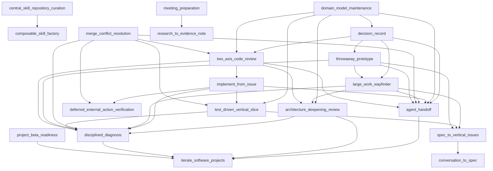

# Skill Dependency Graph

Generated from canonical `requires` and `outputs` frontmatter. Do not edit manually.

## Output contracts

`consumerSkills` are inferred only from hard `requires` edges to a unique producer; ambiguous producers never receive inferred consumers.

| Output | Producers | Consumer skills | Status |
|---|---|---|---|
| `GRILL-REPORT.md` | `round-based-requirements-grilling` | — | orphan |
| `SPEC.md` | `conversation-to-spec` | `spec-to-vertical-issues` | unique |
| `agent-handoff.json` | `agent-handoff` | `decision-record`, `domain-model-maintenance`, `implement-from-issue`, `large-work-wayfinder`, `merge-conflict-resolution`, `throwaway-prototype`, `two-axis-code-review` | unique |
| `agent-handoff.md` | `agent-handoff` | `decision-record`, `domain-model-maintenance`, `implement-from-issue`, `large-work-wayfinder`, `merge-conflict-resolution`, `throwaway-prototype`, `two-axis-code-review` | unique |
| `approved SPEC.md` | `round-based-requirements-grilling` | — | orphan |
| `architecture-review.json` | `architecture-deepening-review` | `domain-model-maintenance`, `large-work-wayfinder`, `two-axis-code-review` | unique |
| `architecture-review.md` | `architecture-deepening-review` | `domain-model-maintenance`, `large-work-wayfinder`, `two-axis-code-review` | unique |
| `beta-readiness.json` | `project-beta-readiness` | — | orphan |
| `beta-readiness.md` | `project-beta-readiness` | — | orphan |
| `beta-runbook.md` | `project-beta-readiness` | — | orphan |
| `conflict-resolution-evidence.json` | `merge-conflict-resolution` | — | orphan |
| `consistency report` | `conversation-to-spec` | `spec-to-vertical-issues` | unique |
| `continuation result` | `deferred-external-action-verification` | `implement-from-issue`, `merge-conflict-resolution` | unique |
| `decision register` | `conversation-to-spec` | `spec-to-vertical-issues` | unique |
| `decision-record.json` | `decision-record` | `domain-model-maintenance` | unique |
| `decision-record.md` | `decision-record` | `domain-model-maintenance` | unique |
| `dependency-graph.json` | `large-work-wayfinder` | `decision-record`, `throwaway-prototype` | unique |
| `dependency-order.json` | `spec-to-vertical-issues` | `large-work-wayfinder`, `test-driven-vertical-slice`, `throwaway-prototype` | unique |
| `diagnosis-report.json` | `disciplined-diagnosis` | `architecture-deepening-review`, `implement-from-issue`, `large-work-wayfinder`, `merge-conflict-resolution`, `test-driven-vertical-slice`, `throwaway-prototype`, `two-axis-code-review` | unique |
| `disposal-record.json` | `throwaway-prototype` | `decision-record` | unique |
| `docs/agents/CONFIG.md` | `repository-skill-bootstrap` | — | orphan |
| `docs/agents/CONTEXT.md` | `repository-skill-bootstrap` | — | orphan |
| `docs/agents/DECISIONS.md` | `repository-skill-bootstrap` | — | orphan |
| `domain-change-plan.md` | `domain-model-maintenance` | — | orphan |
| `domain-model-map.json` | `domain-model-maintenance` | — | orphan |
| `domain-validation.json` | `domain-model-maintenance` | — | orphan |
| `evaluation evidence` | `composable-skill-factory` | `central-skill-repository-curation` | unique |
| `evidence-note.json` | `research-to-evidence-note` | `meeting-preparation` | unique |
| `evidence-note.md` | `research-to-evidence-note` | `meeting-preparation` | unique |
| `execution plan` | `synapse-orchestrator` | — | orphan |
| `expert handoff` | `synapse-orchestrator` | — | orphan |
| `implementation-evidence.json` | `implement-from-issue` | `two-axis-code-review` | unique |
| `import verification` | `openasr-offline-model-import` | — | orphan |
| `inbox-triage.json` | `inbox-action-triage` | — | orphan |
| `inbox-triage.md` | `inbox-action-triage` | — | orphan |
| `installed OpenASR model` | `openasr-offline-model-import` | — | orphan |
| `investigation-backlog.json` | `large-work-wayfinder` | `decision-record`, `throwaway-prototype` | unique |
| `meeting-prep.json` | `meeting-preparation` | — | orphan |
| `meeting-prep.md` | `meeting-preparation` | — | orphan |
| `next increment` | `iterate-software-projects` | `agent-handoff`, `architecture-deepening-review`, `disciplined-diagnosis`, `project-beta-readiness` | unique |
| `next-step-handoff.json` | `architecture-deepening-review` | `domain-model-maintenance`, `large-work-wayfinder`, `two-axis-code-review` | unique |
| `progress summary` | `synapse-orchestrator` | — | orphan |
| `prototype-brief.md` | `throwaway-prototype` | `decision-record` | unique |
| `prototype-evidence.json` | `throwaway-prototype` | `decision-record` | unique |
| `pull request` | `composable-skill-factory` | `central-skill-repository-curation` | unique |
| `quality-review.json` | `two-axis-code-review` | `decision-record`, `domain-model-maintenance`, `merge-conflict-resolution` | unique |
| `requirement-coverage.json` | `two-axis-code-review` | `decision-record`, `domain-model-maintenance`, `merge-conflict-resolution` | unique |
| `residual-risk-handoff.json` | `disciplined-diagnosis`, `implement-from-issue`, `merge-conflict-resolution`, `test-driven-vertical-slice` | — | ambiguous |
| `resolved-change-brief.md` | `merge-conflict-resolution` | — | orphan |
| `review findings` | `iterate-software-projects` | `agent-handoff`, `architecture-deepening-review`, `disciplined-diagnosis`, `project-beta-readiness` | unique |
| `review-decision.md` | `two-axis-code-review` | `decision-record`, `domain-model-maintenance`, `merge-conflict-resolution` | unique |
| `reviewable-change-brief.md` | `implement-from-issue` | `two-axis-code-review` | unique |
| `skills/<skill-name>/SKILL.md` | `composable-skill-factory` | `central-skill-repository-curation` | unique |
| `synchronization manifest` | `central-skill-repository-curation` | — | orphan |
| `ui-prototype-plan.md` | `project-beta-readiness` | — | orphan |
| `updated skill repository` | `central-skill-repository-curation` | — | orphan |
| `verification evidence` | `iterate-software-projects` | `agent-handoff`, `architecture-deepening-review`, `disciplined-diagnosis`, `project-beta-readiness` | unique |
| `verification-report.md` | `test-driven-vertical-slice` | `domain-model-maintenance`, `implement-from-issue`, `merge-conflict-resolution` | unique |
| `verified terminal status` | `deferred-external-action-verification` | `implement-from-issue`, `merge-conflict-resolution` | unique |
| `verified-fix-evidence.md` | `disciplined-diagnosis` | `architecture-deepening-review`, `implement-from-issue`, `large-work-wayfinder`, `merge-conflict-resolution`, `test-driven-vertical-slice`, `throwaway-prototype`, `two-axis-code-review` | unique |
| `vertical-issues.json` | `spec-to-vertical-issues` | `large-work-wayfinder`, `test-driven-vertical-slice`, `throwaway-prototype` | unique |
| `vertical-issues.md` | `spec-to-vertical-issues` | `large-work-wayfinder`, `test-driven-vertical-slice`, `throwaway-prototype` | unique |
| `vertical-slice-evidence.json` | `test-driven-vertical-slice` | `domain-model-maintenance`, `implement-from-issue`, `merge-conflict-resolution` | unique |
| `watch record` | `deferred-external-action-verification` | `implement-from-issue`, `merge-conflict-resolution` | unique |
| `wayfinding-brief.md` | `large-work-wayfinder` | `decision-record`, `throwaway-prototype` | unique |
