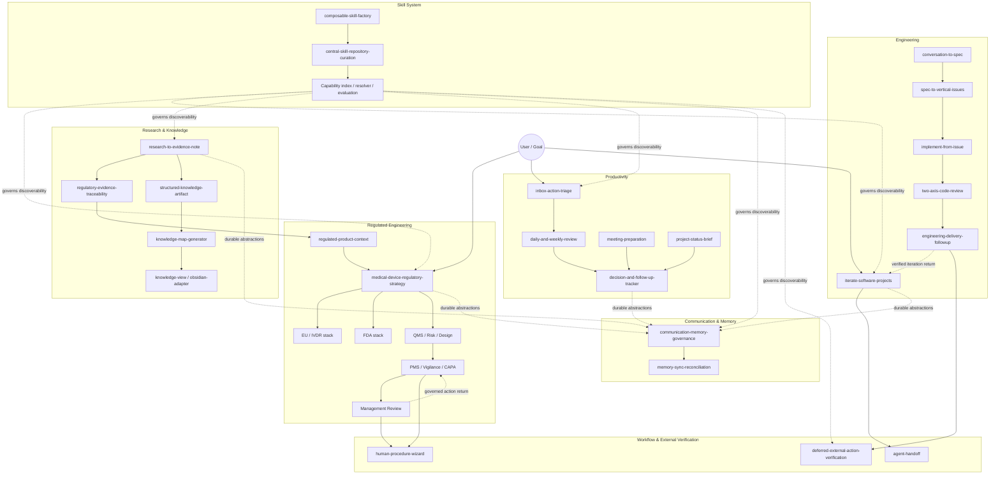
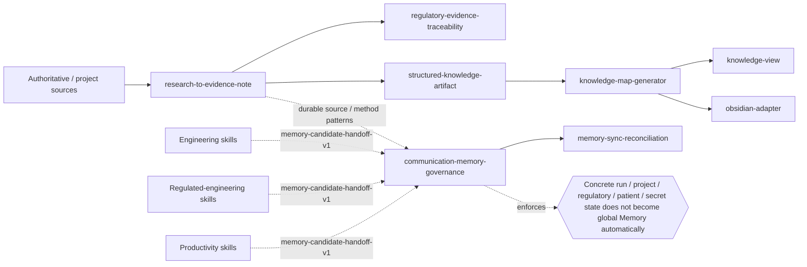
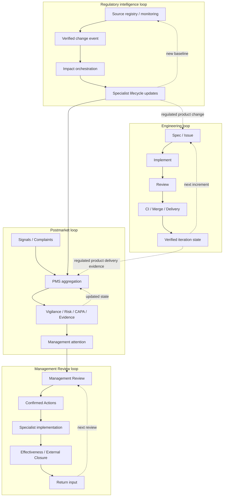

# Skill Universe

Status: curated architecture view  
Canonical capability source: [`skill-capability-index.json`](skill-capability-index.json)  
Canonical hard-dependency source: [`SKILL-DEPENDENCIES.md`](SKILL-DEPENDENCIES.md)

## Purpose

This document is the human-readable architecture map for the `skillz` repository.

It intentionally does **not** reproduce every hard `requires` edge of all skills. The generated [`SKILL-DEPENDENCIES.md`](SKILL-DEPENDENCIES.md) remains the exact machine-derived dependency graph. This Universe view groups capabilities by responsibility, highlights the primary lifecycle paths, and makes the important feedback loops visible.

### Reading the diagrams

- **Solid arrows** show the primary semantic flow or ownership handoff.
- **Dashed arrows** show a temporal feedback or governance return path that is deliberately not modeled as a hard `requires` dependency, usually to avoid cycles.
- **External state** means evidence from CI, deployment platforms, authorities, notified bodies, issue trackers or other systems that must be verified rather than simulated.
- **Memory paths** carry only governed, durable abstractions. Concrete repository state, product records, regulatory decisions and sensitive case data remain run/project/controlled-record state.

---

## 1. Skill Universe — domain map



The important architectural point is that no single top-level orchestrator owns every domain. The repository composes narrow owners around a few shared spines: evidence, verification, delivery, governance and memory.

---

## 2. Engineering lifecycle — closed delivery loop

```mermaid
flowchart LR
    A[conversation-to-spec]
    B[spec-to-vertical-issues]
    C[test-driven-vertical-slice]
    D[implement-from-issue]
    E[two-axis-code-review]
    F[engineering-delivery-followup]
    G[iterate-software-projects]

    DIAG[disciplined-diagnosis]
    ARCH[architecture-deepening-review]
    DOMAIN[domain-model-maintenance]
    MERGE[merge-conflict-resolution]
    EXT[deferred-external-action-verification]
    HANDOFF[agent-handoff]
    BETA[project-beta-readiness]

    A --> B --> C --> D --> E --> F
    F -. engineering-iteration-return-input.json .-> G
    G --> B

    DIAG --> C
    DIAG --> D
    DIAG --> E
    ARCH --> E
    DOMAIN --> E
    E --> DOMAIN
    E --> MERGE
    MERGE --> E
    F --> EXT
    G --> HANDOFF
    G --> BETA

    R1{{review-approved ≠ merge-ready}}
    R2{{merged ≠ deployed}}
    R3{{tracker done ≠ requirement verified}}
    R4{{head changed → review stale}}

    E -.-> R1
    F -.-> R2
    F -.-> R3
    E -.-> R4
```

### Engineering closure contract

The lifecycle deliberately separates these states:

`implemented → review-approved → merge-ready → merged → deployed/released (when applicable) → issue-closed → requirement-verified`

A later state is never inferred solely from an earlier one. `engineering-delivery-followup` owns that distinction and returns the verified prior-iteration state to `iterate-software-projects` before unrelated work is started.

---

## 3. Regulated Engineering — Medical Device / IVD universe

```mermaid
flowchart TB
    subgraph FOUNDATION[Shared regulated-engineering foundations]
        CTX[regulated-product-context]
        RES[research-to-evidence-note]
        TRACE[regulatory-evidence-traceability]
        COMP[two-axis-compliance-review]
        RISK[medical-device-risk-management-iso14971]
        QMS[medical-device-qms-iso13485]
        DEC[decision-record]
    end

    subgraph FRONT[Market front doors]
        STRAT[medical-device-regulatory-strategy]
        EU[eu-mdr-ivdr-regulatory-specialist]
        FDA[fda-medical-device-ivd-regulatory-specialist]
    end

    subgraph IVDR[EU / IVDR]
        MDCG[mdcg-guidance-navigator]
        CLASS[ivdr-device-classification]
        SV[ivdr-scientific-validity]
        AP[ivdr-analytical-performance]
        CPS[ivdr-clinical-performance-study]
        PE[ivdr-performance-evaluation]
        PER[ivdr-performance-evaluation-report]
        PMPF[ivdr-pmpf]
        VIG[ivdr-pms-vigilance]
        CLASSD[ivdr-class-d-conformity]
        EUD[eudamed-udi-ivd]
        CDX[ivdr-companion-diagnostic-consultation]
        INHOUSE[ivdr-inhouse-health-institution]
    end

    subgraph US[FDA]
        FCLASS[fda-device-classification-product-code]
        PRED[fda-510k-predicate-strategy]
        SE[fda-510k-substantial-equivalence]
        DENOVO[fda-de-novo-strategy]
        SPECIAL[fda-de-novo-special-controls]
        QSUB[fda-qsub-strategy]
        ESTAR[fda-estar-submission-builder]
        ACCEPT[fda-acceptance-readiness]
        AI[fda-additional-information-response]
        CLIA[fda-ivd-clia-waiver]
        DUAL[fda-dual-510k-clia-waiver]
        QMSR[fda-qmsr-iso13485-gap]
        INSPECT[fda-qmsr-inspection-readiness]
        MDR[fda-complaint-mdr-reportability]
        CR[fda-corrections-removals]
        PCCP[fda-pccp-change-control]
        LIST[fda-registration-listing-udi]
    end

    subgraph SHARED[Shared lifecycle controls]
        DESIGN[design-control-traceability]
        CHANGE[design-change-regulatory-impact]
        LABEL[medical-device-labeling-ifu]
        CLAIM[regulatory-claims-consistency]
        SW[iec62304-software-lifecycle]
        USE[iec62366-usability-engineering]
        CYBER[medical-device-cybersecurity-lifecycle]
        SUP[supplier-quality-medical-device]
        PROC[process-validation-iq-oq-pq]
        MEAS[measurement-system-validation]
        NC[nonconformance-mrb-disposition]
        RECORD[quality-record-integrity]
        CAPA[medical-device-capa]
    end

    subgraph GOVERNANCE[Postmarket & governance]
        PMS[medical-device-pms-system]
        MR[qms-management-review-governance]
        MRF[qms-management-review-action-followup]
        AUDIT[iso13485-qms-audit]
        MDSAP[mdsap-audit-readiness]
        FIND[audit-inspection-finding-response]
        MON[regulatory-change-monitoring]
        ORCH[regulatory-change-impact-orchestrator]
    end

    RES --> TRACE --> CTX
    CTX --> STRAT
    STRAT --> EU
    STRAT --> FDA
    CTX --> RISK
    CTX --> QMS
    TRACE --> COMP

    EU --> MDCG --> CLASS
    CLASS --> SV
    CLASS --> AP
    CLASS --> CPS
    SV --> PE
    AP --> PE
    CPS --> PE
    PE --> PER
    PE --> PMPF
    PMPF --> PMS
    PMS --> VIG
    CLASS --> CLASSD
    CLASS --> EUD
    PE --> CDX
    QMS --> INHOUSE

    FDA --> FCLASS
    FCLASS --> PRED --> SE --> ESTAR --> ACCEPT
    FCLASS --> DENOVO --> SPECIAL --> ESTAR
    FDA --> QSUB
    ESTAR --> AI
    FCLASS --> CLIA --> DUAL
    SE --> DUAL
    QMS --> QMSR --> INSPECT
    PMS --> MDR --> CR
    CHANGE --> PCCP
    LABEL --> LIST

    QMS --> DESIGN --> CHANGE
    RISK --> DESIGN
    DESIGN --> SW --> CYBER
    DESIGN --> USE
    RISK --> LABEL --> CLAIM
    QMS --> SUP
    QMS --> PROC
    QMS --> MEAS
    QMS --> NC --> CAPA
    QMS --> RECORD

    PMS --> MR --> MRF
    MRF -. management-review-return-input.json .-> MR
    CAPA --> MR
    RISK --> MR
    QMS --> AUDIT --> MDSAP
    AUDIT --> FIND

    MON --> ORCH
    ORCH --> CHANGE
    ORCH --> RISK
    ORCH --> LABEL
    ORCH --> PMS
    ORCH --> PE

    VIG -. material signals .-> PMS
    MRF -. action effectiveness / open gaps .-> PMS
```

### Regulated-engineering governance loops

Three loops are intentionally separate but connected:

1. **Postmarket:** `Vigilance / complaints / field signals → PMS → Risk/CAPA/Performance`.
2. **Management governance:** `PMS → Management Review → Action Follow-up → next Management Review`.
3. **Regulatory intelligence:** `Source change → regulatory-change-monitoring → regulatory-change-impact-orchestrator → specialist owners → lifecycle re-evaluation`.

Time-critical reporting or field action never waits for a periodic management-review cadence.

---

## 4. Evidence, knowledge and memory spine



The knowledge graph and Memory are deliberately different concerns:

- Knowledge artifacts preserve explicit source/provenance relationships.
- Memory governance decides whether an abstracted learning is durable and safe enough to persist.
- Current product records, submissions, incidents, findings, SHAs, CI state, credentials and sensitive case data stay outside global Memory.

---

## 5. Closed-loop architecture at a glance



---

## Canonical vs curated views

Use this document when the question is **“How does the whole skill system fit together?”**

Use [`SKILL-DEPENDENCIES.md`](SKILL-DEPENDENCIES.md) when the question is **“What are the exact hard `requires` and inferred output-consumer edges?”**

Use [`skill-capability-index.json`](skill-capability-index.json) when a tool or agent needs the canonical machine-readable capability inventory and evaluation status.

The Universe should therefore stay **curated and semantically stable**. New individual skills belong here only when they introduce a new architectural responsibility, lifecycle boundary or feedback loop; ordinary workers remain visible in the exact generated dependency graph.
