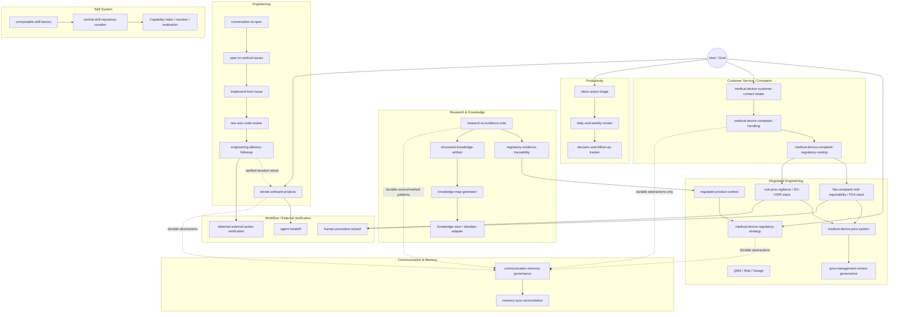
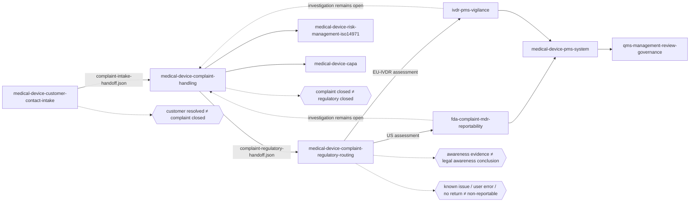
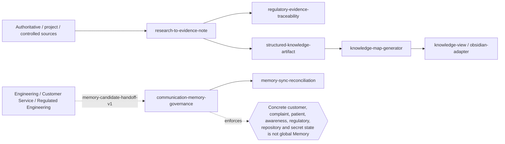
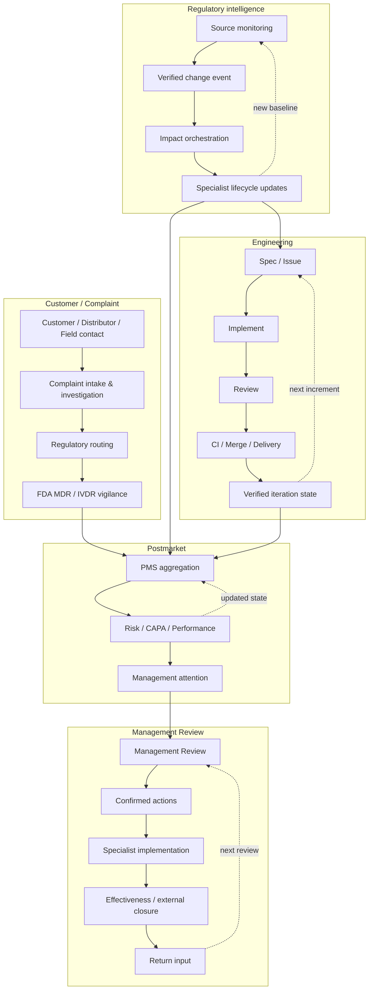

# Skill Universe

Status: curated architecture view  
Canonical capability source: [`skill-capability-index.json`](skill-capability-index.json)  
Canonical hard-dependency source: [`SKILL-DEPENDENCIES.md`](SKILL-DEPENDENCIES.md)

## Purpose

This document is the human-readable architecture map for the `skillz` repository. It intentionally does **not** reproduce every hard `requires` edge. The generated [`SKILL-DEPENDENCIES.md`](SKILL-DEPENDENCIES.md) remains the exact machine-derived graph; this view highlights responsibilities, lifecycle paths and feedback loops.

Current canonical inventory after the customer-service/complaint wave: **107 skills, 89 user-facing entrypoints, 107/107 evaluation suites passing, 0 evaluation errors**.

### Reading the diagrams

- **Solid arrows** show primary semantic flow or ownership handoff.
- **Dashed arrows** show temporal/governance feedback that is deliberately not encoded as a hard cyclic dependency.
- **External state** means CI, deployment, authority, notified-body, customer or issue-tracker state that must be verified rather than simulated.
- **Memory paths** carry only governed durable abstractions; concrete repository, customer, complaint, patient, regulatory and current case state remains project/run/controlled-record state.

---

## 1. Skill Universe — domain map



No single top-level orchestrator owns every domain. Narrow owners compose around shared evidence, verification, delivery, QMS and memory spines.

---

## 2. Engineering lifecycle — closed delivery loop

```mermaid
flowchart LR
    A[conversation-to-spec]
    B[spec-to-vertical-issues]
    C[test-driven-vertical-slice]
    D[implement-from-issue]
    E[two-axis-code-review]
    F[engineering-delivery-followup]
    G[iterate-software-projects]
    EXT[deferred-external-action-verification]

    A --> B --> C --> D --> E --> F
    F -. engineering-iteration-return-input.json .-> G
    G --> B
    F --> EXT

    R1{{review-approved ≠ merge-ready}}
    R2{{merged ≠ deployed}}
    R3{{tracker done ≠ requirement verified}}
    R4{{head changed → review stale}}

    E -.-> R1
    F -.-> R2
    F -.-> R3
    E -.-> R4
```

Engineering state remains explicit:

`implemented → review-approved → merge-ready → merged → deployed/released when applicable → issue-closed → requirement-verified`

A later state is never inferred solely from an earlier one.

---

## 3. Customer contact → complaint → vigilance



### Ownership boundaries

- `medical-device-customer-contact-intake` owns source-preserving intake and the earliest possible Complaint/Safety handoff. It does not investigate or decide reportability.
- `medical-device-complaint-handling` owns the individual complaint QMS record, investigation decision, evidence preservation and complaint-closure readiness. It does not decide FDA MDR or EU vigilance.
- `medical-device-complaint-regulatory-routing` owns jurisdiction/role routing and the awareness-evidence chronology. It does not convert evidence into a legal awareness date or final reportability decision.
- `fda-complaint-mdr-reportability` owns FDA-specific awareness, MDR criteria and timing.
- `ivdr-pms-vigilance` owns IVDR-specific vigilance/serious-incident assessment and its PMS feedback.

### Hard customer-service invariants

1. Customer wording does not determine whether a possible complaint exists.
2. Troubleshooting, refund, replacement or a solved service ticket never erase the Quality path.
3. Potential safety information is escalated before final root cause, returned-device analysis or complaint closure.
4. Every complaint keeps an individual record; a prior investigation may be referenced only with documented applicability.
5. Potentially relevant returned devices, samples, logs and raw evidence are protected before destructive handling.
6. One complaint can require multiple independent jurisdiction assessments.
7. Customer/distributor/employee/QA/regulatory timestamps remain separate evidence facts; the market specialist owns the legal awareness conclusion.
8. External authority submission, receipt and acceptance require external evidence.

---

## 4. Regulated Engineering — lifecycle universe

```mermaid
flowchart TB
    subgraph FOUNDATION[Foundations]
        CTX[regulated-product-context]
        RES[research-to-evidence-note]
        TRACE[regulatory-evidence-traceability]
        QMS[medical-device-qms-iso13485]
        RISK[medical-device-risk-management-iso14971]
        DESIGN[design-control-traceability]
    end

    subgraph MARKET[Market access]
        STRAT[medical-device-regulatory-strategy]
        EU[EU / IVDR capabilities]
        US[FDA capabilities]
    end

    subgraph POST[Postmarket]
        CONTACT[Customer contact]
        COMPLAINT[Complaint handling]
        ROUTE[Regulatory routing]
        FDA_MDR[FDA MDR]
        EU_VIG[IVDR vigilance]
        PMS[PMS system]
        CAPA[CAPA]
        PERF[Performance / PMPF]
        CHANGE[Change impact]
    end

    subgraph GOV[Governance]
        MR[Management Review]
        MRF[Management Review action follow-up]
        AUDIT[ISO 13485 / MDSAP / FDA inspection]
        MON[Regulatory change monitoring]
        ORCH[Regulatory change impact orchestrator]
    end

    RES --> TRACE --> CTX
    CTX --> STRAT --> EU
    STRAT --> US
    CTX --> QMS --> DESIGN
    CTX --> RISK

    CONTACT --> COMPLAINT --> ROUTE
    ROUTE --> FDA_MDR
    ROUTE --> EU_VIG
    FDA_MDR --> PMS
    EU_VIG --> PMS
    COMPLAINT --> CAPA
    COMPLAINT --> RISK
    PMS --> PERF
    PMS --> CAPA
    PMS --> RISK
    RISK --> CHANGE

    PMS --> MR --> MRF
    MRF -. management-review-return-input.json .-> MR
    QMS --> AUDIT
    MON --> ORCH --> CHANGE
    ORCH --> PMS
    ORCH --> PERF
```

The key regulated-engineering loops remain separate but connected:

1. **Customer/Complaint:** contact → complaint → jurisdiction routing → market-specific vigilance/reportability.
2. **Postmarket:** complaints/vigilance/field signals → PMS → Risk/CAPA/Performance.
3. **Management governance:** PMS → Management Review → Action Follow-up → next Management Review.
4. **Regulatory intelligence:** source change → change monitoring → impact orchestration → specialist lifecycle update.

Time-critical reportability, vigilance or field action never waits for complaint closure or a periodic management-review cadence.

---

## 5. Evidence, knowledge and memory spine



Knowledge and Memory remain different concerns:

- Knowledge artifacts preserve explicit source/provenance relationships.
- Memory governance decides whether an abstracted learning is durable and safe enough to persist.
- Current contacts, complaints, patients/reporters, device/lot IDs, awareness dates, reportability decisions, submissions, findings, SHAs, CI state and credentials remain outside global Memory.

---

## 6. Closed-loop architecture at a glance



---

## Canonical vs curated views

Use this document for **“How does the whole skill system fit together?”**

Use [`SKILL-DEPENDENCIES.md`](SKILL-DEPENDENCIES.md) for **exact hard `requires` and inferred output-consumer edges**.

Use [`skill-capability-index.json`](skill-capability-index.json) for the canonical machine-readable inventory and evaluation state.

The Universe remains curated and semantically stable. Individual workers belong here only when they introduce a new architectural responsibility, lifecycle boundary or feedback loop; ordinary workers stay visible in the generated dependency graph.
